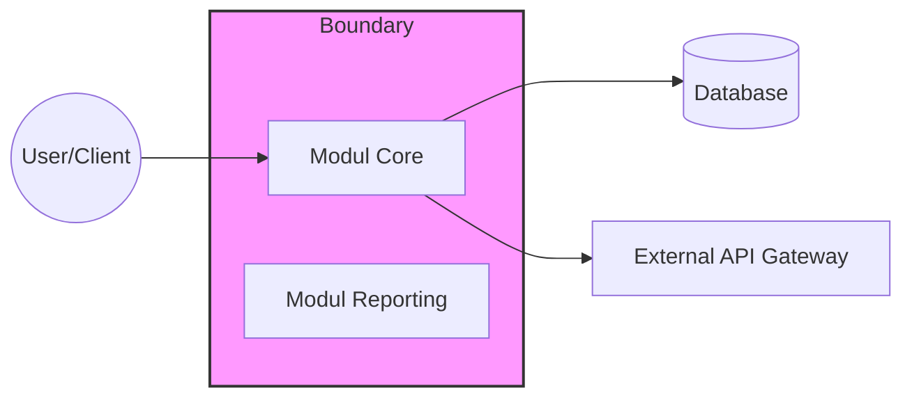

# BAB 1: INTRODUCTION

Bagian ini memberikan gambaran umum mengenai dokumen dan orientasi bagi pembaca terhadap sistem yang dispesifikasikan. Bab ini merangkum tujuan Software Requirements Specification (SRS), ruang lingkup produk, audiens yang dituju, dan organisasi dokumen tanpa menyertakan detail teknis mendalam yang akan dibahas pada bab selanjutnya.

---

## 1.1 Tujuan Dokumen (Document Purpose)

**Perintah (Instructions)**

Tuliskan tujuan pembuatan dokumen Software Design Document (SDD) ini secara jelas dalam 2 hingga 4 kalimat. Jelaskan mengapa dokumen ini eksis, apa yang dikandungnya, dan siapa pemangku kepentingan (stakeholder) utama yang akan menggunakan dokumen ini (seperti tim Engineering, QA, Product, Security, atau Compliance). Tekankan bahwa dokumen ini mendefinisikan apa yang harus dilakukan sistem tanpa mendikte detail implementasi spesifik di luar konteks desain. Sebutkan pula dokumen terkait lainnya seperti dokumen visi, arsitektur, atau kontrak jika relevan dalam siklus hidup pengembangan perangkat lunak.

**Contoh (Example)**

Dokumen Software Design Document (SDD) ini disusun untuk memberikan definisi teknis dan fungsional yang komprehensif bagi sistem . Dokumen ini berfungsi sebagai panduan utama bagi tim Software Engineer dalam implementasi kode, tim Quality Assurance dalam penyusunan rencana pengujian, serta tim Arsitek dalam memastikan kesesuaian struktur sistem dengan kebutuhan bisnis. Fokus utama dokumen ini adalah menjamin pemahaman yang selaras mengenai perilaku sistem dan batasan operasional di seluruh siklus pengembangan.

---

## 1.2 Ruang Lingkup Produk (Product Scope)

**Perintah (Instructions)**

Identifikasi produk berdasarkan nama dan versi atau rilisnya. Jelaskan dalam 3 hingga 5 kalimat mengenai tujuan utama produk, kemampuan kunci, dan hasil yang diharapkan (outcomes). Definisikan batasan sistem secara eksplisit dengan mencantumkan apa yang termasuk (inclusions) dan apa yang tidak termasuk (exclusions) dalam cakupan pengembangan, terutama jika sistem ini merupakan bagian dari ekosistem yang lebih besar. Gunakan diagram Mermaid untuk memvisualisasikan batasan sistem (system boundary) terhadap aktor eksternal atau sistem lain guna memperjelas konteks operasional.

**Contoh (Example)**

Sistem  versi <1.0.0> adalah platform <Jenis Sistem/Aplikasi> yang dirancang untuk mengotomatisasi . Ruang lingkup mencakup pengembangan modul , , dan integrasi dengan . Dokumen ini tidak mencakup pengembangan infrastruktur server fisik atau manajemen database di sisi pihak ketiga. Fokus utama adalah pada penyediaan antarmuka yang responsif dan logika pemrosesan data real-time.

---

## 1.3 Definisi, Akronim, dan Singkatan (Definitions, Acronyms, and Abbreviations)

**Perintah (Instructions)**

Sediakan glosarium yang berisi istilah domain spesifik, akronim, dan singkatan yang digunakan di dalam dokumen untuk memastikan interpretasi yang konsisten di antara pembaca. Masukkan istilah yang berdampak langsung pada pemahaman persyaratan teknis, seperti definisi user, tenant, atau istilah teknis spesifik industri. Susun entri berdasarkan urutan abjad (alphabetical order) agar mudah dicari oleh pemangku kepentingan seperti Technical Writer atau System Analyst.

**Contoh (Example)**

| Istilah | Definisi |
| --- | --- |
| API | Application Programming Interface - Kumpulan definisi dan protokol untuk membangun dan mengintegrasikan perangkat lunak aplikasi. |
| SDD | Software Design Document - Dokumen teknis yang menguraikan desain arsitektur dan detail komponen sistem. |
| SRS | Software Requirements Specification - Dokumen yang menjelaskan tujuan, persyaratan, dan sifat perangkat lunak yang akan dibangun. |
| UI | User Interface - Bagian visual dari aplikasi komputer tempat pengguna berinteraksi dengan perangkat lunak. |

---

## 1.4 Referensi (References)

**Perintah (Instructions)**

Daftarkan semua sumber eksternal yang menjadi referensi normatif (mengikat) atau informatif (panduan) bagi dokumen ini. Referensi dapat berupa standar industri, kontrak bisnis, kebijakan organisasi, spesifikasi antarmuka, panduan gaya UX (Style Guides), atau keputusan arsitektur (ADR). Untuk setiap referensi, cantumkan judul, pemilik/penulis, versi, tanggal, dan lokasi akses atau URL. Gunakan tautan yang stabil atau jalur repositori yang konsisten untuk memudahkan tim DevOps atau Security melakukan audit.

**Contoh (Example)**

| Dokumen | Penulis/Pemilik | Versi/Tanggal | Lokasi/URL |
| --- | --- | --- | --- |
| Business Requirements Document |  | v2.1 (2024) | <Link Repositori/Sharepoint> |
| Enterprise Architecture Guideline |  | v1.0 (2023) | <Link Repositori/Sharepoint> |
| ISO/IEC 25010 (System Quality) | <ISO/IEC> | 2011 | <Link Repositori/Sharepoint> |

---

## 1.5 Ikhtisar Dokumen (Document Overview)

**Perintah (Instructions)**

Berikan panduan singkat mengenai struktur dokumen agar pembaca dapat menavigasi informasi dengan cepat. Ringkas apa yang dibahas pada setiap bab utama (seperti Gambaran Umum Produk, Persyaratan Detail, Verifikasi, atau Lampiran). Sebutkan konvensi penulisan yang digunakan jika ada, serta bagaimana mekanisme pembaruan atau riwayat revisi dikelola di dalam proyek enterprise tersebut. Fokuskan bagian ini pada aspek navigasi dan konvensi dokumen dalam 3 hingga 5 kalimat.

**Contoh (Example)**

Dokumen ini terbagi menjadi beberapa bagian utama: Bab 1 membahas konteks sistem, Bab 2 menjelaskan deskripsi sistem secara keseluruhan, dan Bab 3 merinci persyaratan fungsional serta non-fungsional. Detail teknis mengenai skema database dan desain antarmuka tersedia pada bab selanjutnya. Seluruh pembaruan dokumen ini dikelola melalui sistem version control <Git/SVN> dengan prosedur tinjauan (review) yang melibatkan  dan .

---