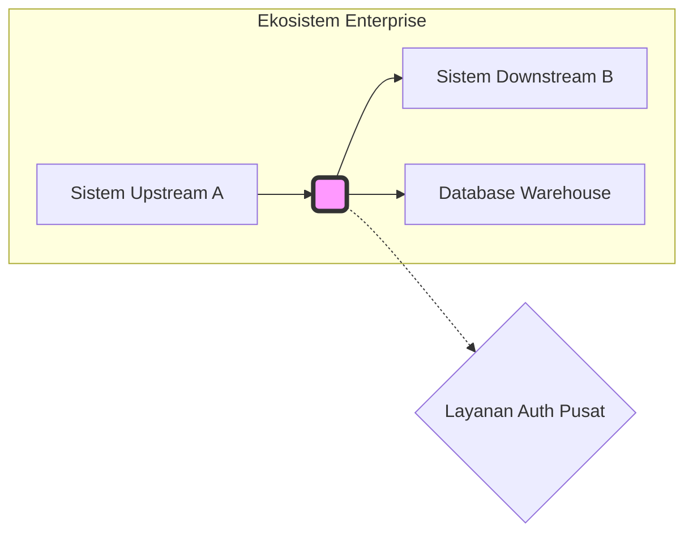
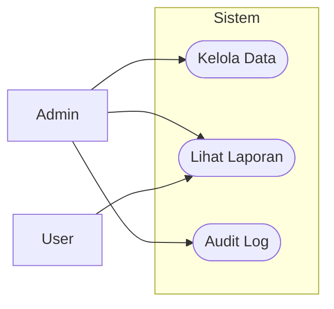

# BAB 2: PRODUCT OVERVIEW

Bagian ini memberikan latar belakang dan konteks yang memengaruhi persyaratan produk. Bab ini menjelaskan di mana posisi sistem dalam ekosistem yang lebih luas, fungsi utamanya, batasan desain, karakteristik pengguna, serta asumsi-asumsi yang mendasari pengembangan sistem.

---

## 2.1 Perspektif Produk (Product Perspective)

**Perintah (Instructions)**

Jelaskan konteks dan asal-usul produk, apakah sistem ini merupakan produk baru, pengganti sistem lama, atau bagian dari keluarga produk yang sudah ada. Jika produk merupakan bagian dari ekosistem yang lebih besar, uraikan hubungan antarkomponen, antarmuka eksternal, dan dependensi kunci. Sertakan detail mengenai kepemilikan sistem, Service Level Agreements (SLAs), dan model dukungan operasional. Gunakan diagram Mermaid tipe 'graph' untuk menggambarkan diagram konteks tingkat tinggi (High-Level Context Diagram) yang menunjukkan batas kepemilikan dan aliran data dengan sistem upstream/downstream agar pembaca memahami batasan tanggung jawab sistem.

**Contoh (Example)**

Sistem  merupakan modul inti baru dalam ekosistem  yang dirancang untuk menggantikan modul legacy . Sistem ini bertindak sebagai aggregator data pusat yang menghubungkan  dengan . Kepemilikan teknis berada di bawah tim  dengan target ketersediaan layanan (SLA) sebesar 99.9% pada jam operasional bisnis.

---

## 2.2 Fungsi Produk (Product Functions)

**Perintah (Instructions)**

Berikan ringkasan singkat mengenai area fungsional atau fitur utama yang disediakan oleh produk bagi pengguna atau sistem lain. Fokuskan pada "apa" yang dilakukan sistem secara garis besar, tanpa masuk ke detail perilaku teknis, validasi data, atau edge cases yang akan dibahas pada bab persyaratan detail. Gunakan daftar poin (bullet points) antara 5 hingga 10 poin untuk mengelompokkan fungsi-fungsi terkait secara logis. Jika diperlukan, sertakan diagram Use Case sederhana menggunakan Mermaid untuk memvisualisasikan interaksi aktor utama dengan fungsi sistem.

**Contoh (Example)**

Sistem  menyediakan kapabilitas utama sebagai berikut:

- Manajemen Identitas: Melakukan otentikasi dan otorisasi pengguna berbasis peran (RBAC).
- Pemrosesan Transaksi: Mengelola alur kerja transaksi dari inisiasi hingga penyelesaian (settlement).
- Pelaporan Real-time: Menyediakan dasbor visualisasi data untuk aktivitas operasional harian.
- Integrasi API: Menyediakan endpoint RESTful bagi sistem pihak ketiga untuk sinkronisasi data.

---

## 2.3 Batasan Produk (Product Constraints)

**Perintah (Instructions)**

Definisikan batasan kontekstual atau kondisi yang membentuk desain dan implementasi sistem. Cantumkan batasan seperti antarmuka yang diwajibkan, tumpukan teknologi (tech stack) yang harus digunakan, kewajiban regulasi (seperti GDPR atau ISO), standar kualitas layanan (QoS), batasan perangkat keras, serta kebijakan organisasi. Nyatakan batasan sebagai pernyataan "harus" (must) yang dapat diverifikasi. Bedakan antara batasan eksternal yang tidak dapat diubah dan batasan internal yang diputuskan oleh organisasi. Hindari mencantumkan keputusan desain kecuali jika keputusan tersebut memang merupakan mandat yang mengikat dari arsitektur enterprise.

**Contoh (Example)**

Pengembangan sistem  terikat pada batasan berikut:

- Teknologi: Aplikasi harus dibangun menggunakan <Bahasa/Framework> versi sesuai standar arsitektur perusahaan.
- Keamanan: Seluruh data sensitif harus dienkripsi saat istirahat (at rest) menggunakan algoritma AES-256.
- Kepatuhan: Sistem harus mematuhi regulasi mengenai retensi data pengguna selama 5 tahun.
- Infrastruktur: Deploymen harus dilakukan pada lingkungan cloud di region .

---

## 2.4 Karakteristik Pengguna (User Characteristics)

**Perintah (Instructions)**

Identifikasi kelas pengguna, peran (roles), dan persona yang akan berinteraksi dengan sistem. Jelaskan atribut yang memengaruhi persyaratan seperti tingkat keahlian teknis, tingkat akses (privileges), frekuensi penggunaan, kebutuhan aksesibilitas, dan tujuan utama mereka menggunakan sistem. Definisikan kelas pengguna berdasarkan perilaku dan tanggung jawab, bukan hanya sekadar jabatan formal. Sertakan pula pertimbangan lokalisasi atau kebutuhan khusus pada antarmuka (UI/UX) jika relevan dengan profil pengguna tersebut.

**Contoh (Example)**

| Kelas Pengguna | Tingkat Keahlian | Frekuensi Penggunaan | Hak Akses | Tujuan Utama |
| --- | --- | --- | --- | --- |
| Operator Data | Menengah | Tinggi (Harian) | Read/Write Limited | Melakukan input dan validasi data operasional. |
| System Admin | Ahli | Rendah (Ad-hoc) | Superuser/Full | Mengelola konfigurasi sistem dan hak akses user. |
| Eksekutif | Awam | Rendah (Mingguan) | Read Only | Memantau KPI melalui laporan ringkasan/dashboard. |

---

## 2.5 Asumsi dan Dependensi (Assumptions and Dependencies)

**Perintah (Instructions)**

Daftarkan faktor-faktor eksternal yang diasumsikan benar (asumsi) dan kondisi yang sangat bergantung pada pihak luar (dependensi) agar proyek dapat berjalan sukses. Asumsi berkaitan dengan kondisi lingkungan, ketersediaan perangkat keras, pola penggunaan pengguna, atau dukungan organisasi. Dependensi berkaitan dengan sistem eksternal, pustaka (libraries), atau tim lain yang berada di luar kendali langsung proyek. Untuk setiap poin, jelaskan potensi dampak yang akan terjadi jika asumsi tersebut terbukti salah atau jika dependensi tidak terpenuhi (risk impact).

**Contoh (Example)**

- Asumsi: Diasumsikan bahwa infrastruktur jaringan internal memiliki latency di bawah ms untuk mendukung sinkronisasi data real-time. Jika gagal, maka performa sinkronisasi akan menurun.
- Dependensi: Sistem bergantung pada tersedianya API dari yang harus stabil pada versi . Perubahan skema pada API tersebut akan mengharuskan pembaruan pada modul integrasi kita.
- Dependensi: Tim DevOps menyediakan pipeline CI/CD yang siap digunakan pada <Tanggal/Milestone>.

---

## 2.6 Pembagian Persyaratan (Apportioning of Requirements)

**Perintah (Instructions)**

Jelaskan bagaimana persyaratan utama dialokasikan ke berbagai sub-sistem, layanan, atau iterasi rilis/fase pengembangan. Gunakan tabel referensi silang untuk menunjukkan persyaratan mana yang akan diimplementasikan pada rilis saat ini dan mana yang ditangguhkan ke rilis mendatang. Bagian ini sangat penting bagi Project Manager dan Product Owner untuk melacak peta jalan (roadmap) produk secara teknis. Jika terdapat persyaratan yang alokasinya belum ditentukan, tandai secara eksplisit untuk ditindaklanjuti pada fase desain berikutnya.

**Contoh (Example)**

| ID Persyaratan | Nama Fitur | Alokasi Sub-sistem | Target Rilis | Status |
| --- | --- | --- | --- | --- |
| FR-01 | Login & Auth | Auth Service | v1.0.0 | Mandatory |
| FR-02 | Dashboard | Web Frontend | v1.0.0 | Mandatory |
| FR-03 | Export PDF | Worker Service | v1.1.0 | Deferred |
| FR-04 | AI Analytics | ML Engine | v2.0.0 | Future Research |

---