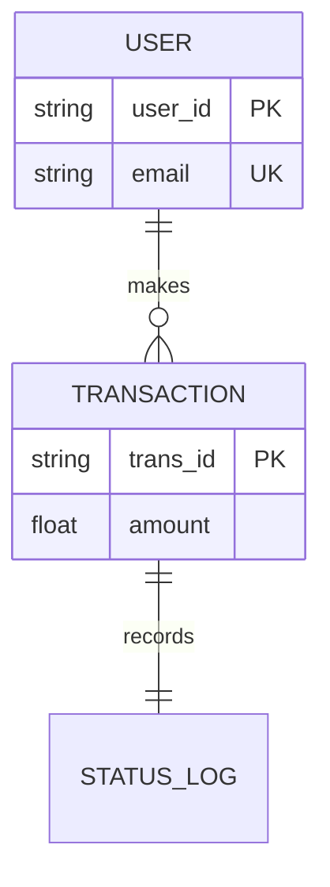
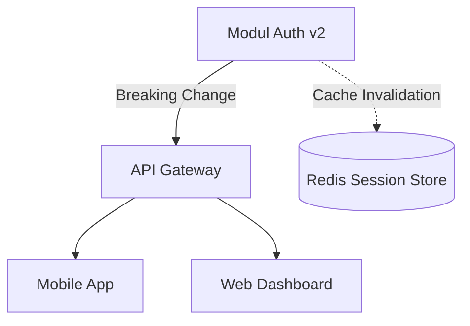

# BAB 5: APPENDIXES

Bagian ini berisi materi pendukung opsional yang membantu pemahaman teknis lebih mendalam mengenai sistem. Lampiran mencakup detail yang terlalu teknis atau terlalu luas jika dimasukkan ke dalam bab utama, seperti kamus data, dataset contoh, analisis risiko, serta glosarium teknis tambahan yang bersifat non-normatif.

---


## [INI ADALAH CONTOH!!!]
## 5.1 Kamus Data (Data Dictionary)
**Perintah (Instructions)**

Sediakan definisi teknis mengenai elemen data yang digunakan dalam sistem. Bagian ini harus merinci nama field, tipe data, batasan (constraints), deskripsi fungsional, serta relasi antar entitas jika tidak dijelaskan secara detail di Bab 3. Informasi ini sangat krusial bagi Database Administrator (DBA), Backend Engineer, dan System Analyst untuk menjaga integritas data di seluruh lapisan aplikasi. Jika terdapat skema relasional yang kompleks, gunakan diagram Mermaid ERD untuk memvisualisasikan hubungan antar tabel atau koleksi data.

**Contoh (Example)**

Berikut adalah rincian entitas utama pada modul :

| Nama Field | Tipe Data | Batasan | Deskripsi |
| --- | --- | --- | --- |
| user_id | UUID | Primary Key, Not Null | Identitas unik global untuk setiap pengguna. |
| transaction_amount | Decimal(18,2) | Min: 0.01 | Nilai moneter transaksi dalam mata uang . |
| status_code | Enum | ['PENDING', 'SUCCESS'] | Status siklus hidup transaksi saat ini. |



---

## 5.2 Dataset Contoh dan Skema API (Sample Datasets and API Schemas)

**Perintah (Instructions)**

Sajikan contoh data nyata dalam format JSON, XML, atau CSV yang merepresentasikan input dan output sistem. Bagian ini membantu Frontend Developer dan QA Engineer dalam melakukan mocking data atau penyusunan skrip uji otomatis. Sertakan skema respon untuk kondisi sukses dan kondisi galat (error) guna memastikan konsistensi kontrak API. Batasi pembahasan pada contoh yang paling mewakili skenario jalur utama (happy path) dan skenario batas (edge cases).

**Contoh (Example)**

Contoh payload respon untuk endpoint <GET /api/v1/profile>:

```jsx
{
  "status": "success",
  "data": {
    "profile_id": "<PRO-12345>",
    "full_name": "<Nama Pengguna>",
    "preferences": {
      "language": "id",
      "notifications": true
    }
  },
  "metadata": {
    "request_id": "<REQ-ID-9900>",
    "timestamp": "2024-05-20T10:00:00Z"
  }
}
```

---

## 5.3 Analisis Dampak Perubahan (Change Impact Analysis)

**Perintah (Instructions)**

Jelaskan analisis mengenai bagaimana perubahan pada satu komponen sistem dapat memengaruhi komponen lainnya. Bagian ini digunakan oleh Software Architect dan Project Manager untuk menilai risiko teknis saat melakukan pembaruan atau refaktor. Fokuskan pada dependensi antar modul, potensi regresi pada integrasi pihak ketiga, serta dampak pada basis data yang sudah ada (legacy data). Gunakan diagram Mermaid tipe graph untuk memetakan rantai ketergantungan (dependency chain) antar layanan atau modul inti.

**Contoh (Example)**

Analisis dampak untuk migrasi  ke :

- Dampak Langsung: Modul harus diperbarui untuk mendukung skema token baru.
- Dampak Tidak Langsung: Cache session pada akan di-invalidate secara massal.
- Risiko: Potensi lonjakan latensi login selama 5 menit pertama pasca-deployment.



---

## 5.4 Glosarium Teknis dan Referensi Pendukung (Technical Glossary & References)

**Perintah (Instructions)**

Daftarkan istilah-istilah teknis sangat spesifik, library pihak ketiga, atau standar industri yang tidak tercantum dalam Bab 1. Lampirkan pula tautan ke dokumen desain eksternal, paper penelitian, atau wiki internal yang menjadi inspirasi arsitektur. Bagian ini berfungsi sebagai pusat pengetahuan bagi anggota tim baru (onboarding) agar mereka dapat memahami terminologi dan referensi yang digunakan dalam pengembangan sistem ini. Pastikan setiap entri memiliki definisi yang jelas dan tautan referensi yang masih aktif.

**Contoh (Example)**

| Istilah | Referensi / Tautan | Penjelasan |
| --- | --- | --- |
| Idempotency Key | <RFC 7231> | Mekanisme untuk menjamin bahwa request yang sama tidak dieksekusi dua kali. |
| Blue-Green Deployment |  | Strategi rilis yang digunakan untuk meminimalkan downtime sistem. |
| Circuit Breaker |  | Pola desain untuk menghentikan kegagalan berantai pada microservices. |

---