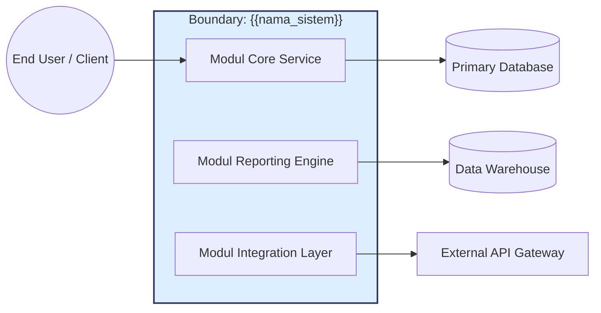

# BAB 1: INTRODUCTION

Bagian ini memberikan gambaran umum dokumen dan mengorientasikan pembaca terhadap sistem yang akan dirancang. Bab ini merangkum tujuan Software Design Description (SDD), ruang lingkup desain, audiens yang dituju, serta struktur organisasi dokumen, tanpa menyertakan detail implementasi teknis yang akan diuraikan pada bab selanjutnya.

---

## 1.1 Document Purpose

Bagian ini mendefinisikan alasan keberadaan dokumen MSDD, audiens sasarannya, serta cara dokumen ini digunakan dalam siklus hidup pengembangan perangkat lunak.

---

**Perintah (Instructions)**

Tuliskan tujuan pembuatan dokumen Software Design Description (SDD) ini secara eksplisit dalam 2 hingga 4 kalimat. Jelaskan mengapa dokumen ini ada, apa yang dikandungnya, dan siapa pemangku kepentingan (stakeholder) utama yang akan menggunakannya — meliputi tim Software Engineering, Quality Assurance, Arsitektur, Security, DevOps, maupun Compliance. Tekankan bahwa MSDD merupakan jembatan antara spesifikasi kebutuhan (MSRS) dengan implementasi kode aktual: dokumen ini mendefinisikan “bagaimana” sistem dibangun, bukan sekadar “apa” yang harus dilakukan sistem. Sebutkan pula dokumen terkait seperti MSRS, MADR, panduan UI/UX, atau kontrak API eksternal jika relevan dalam ekosistem dokumentasi proyek.

**Catatan:** Dokumen ini secara langsung melengkapi MSRS (Markdown Software Requirements Specification) dan harus selalu dibaca bersama dokumen tersebut. Setiap elemen desain yang didefinisikan di sini harus dapat ditelusuri kembali ke setidaknya satu butir persyaratan di MSRS.

### Contoh (Example)

Dokumen Software Design Description (SDD) ini disusun untuk memberikan definisi arsitektural dan teknis yang komprehensif bagi sistem `{{nama_sistem}}` versi `{{versi}}`. Dokumen ini berfungsi sebagai panduan utama bagi tim Software Engineer dalam implementasi kode, tim Quality Assurance dalam penyusunan rencana pengujian, serta tim Arsitek dalam memastikan kesesuaian struktur sistem dengan kebutuhan bisnis yang telah didefinisikan pada MSRS. Fokus utama dokumen ini adalah menjamin pemahaman yang selaras mengenai arsitektur, keputusan desain, dan interaksi antar komponen di seluruh siklus pengembangan. Dokumen ini dibaca bersama dengan `docs/requirements/srs.md` (MSRS) dan `docs/decisions/` (MADR).

---

## 1.2 Subject Scope

Bagian ini mengidentifikasi sistem yang dirancang, tujuan arsitektur utamanya, serta batasan eksplisit yang membedakan apa yang termasuk dan tidak termasuk dalam cakupan desain ini.

---

**Perintah (Instructions)**

Identifikasi sistem berdasarkan nama resmi dan versi atau rilisnya. Jelaskan dalam 3 hingga 5 kalimat mengenai tujuan arsitektur utama, kemampuan desain kunci, dan hasil yang diharapkan dari perspektif struktural dan operasional. Definisikan batasan sistem secara eksplisit dengan mencantumkan apa yang termasuk (inclusions) dan apa yang tidak termasuk (exclusions) dalam cakupan desain — khususnya jika sistem ini merupakan bagian dari ekosistem yang lebih besar. Sertakan diagram Mermaid untuk memvisualisasikan batasan sistem (system boundary) terhadap aktor eksternal atau sistem lain guna memperjelas konteks operasional dan tanggung jawab arsitektural.

**Catatan:** Ruang lingkup desain harus selaras dengan `Product Scope` yang didefinisikan pada MSRS sub-bab 1.2. Jika terdapat perbedaan, catat sebagai item perubahan yang memerlukan pembaruan pada kedua dokumen secara bersamaan.

### Contoh (Example)

Sistem `{{nama_sistem}}` versi `{{versi}}` adalah platform `{{jenis_sistem}}` yang dirancang untuk mengotomatisasi `{{fungsi_utama}}`. Ruang lingkup desain ini mencakup arsitektur modul `{{modul_1}}`, `{{modul_2}}`, dan desain integrasi dengan `{{sistem_eksternal}}`. Dokumen ini tidak mencakup desain infrastruktur server fisik, manajemen basis data pihak ketiga, maupun antarmuka pengguna akhir di luar batas API sistem. Fokus utama adalah pada arsitektur pemrosesan data, pola komunikasi antar layanan, dan keputusan desain yang memengaruhi kualitas layanan jangka panjang.

---

## 1.3 Definitions, Acronyms, and Abbreviations

Bagian ini menyediakan glosarium yang berisi istilah teknis spesifik, pola arsitektur, akronim, dan singkatan yang digunakan di dalam dokumen untuk memastikan interpretasi yang konsisten di antara seluruh pembaca.

---

**Perintah (Instructions)**

Sediakan glosarium yang mencakup istilah domain arsitektur, pola desain teknis, akronim, dan singkatan yang digunakan di dalam dokumen. Masukkan istilah yang berdampak langsung pada pemahaman keputusan desain, seperti nama pola arsitektur (misalnya CQRS, Saga Pattern), protokol komunikasi, atau istilah teknis spesifik industri. Susun entri berdasarkan urutan abjad agar mudah dicari. Jika terdapat istilah yang memiliki definisi berbeda pada konteks ini dibandingkan penggunaan umum, berikan klarifikasi eksplisit.

**Catatan:** Glosarium ini bersifat adiktif terhadap glosarium MSRS. Jika suatu istilah telah didefinisikan di MSRS sub-bab 1.3, tidak perlu didefinisikan ulang di sini kecuali jika konteks desainnya berbeda secara signifikan.

### Contoh (Example)

| Istilah | Definisi |
| --- | --- |
| ADR | Architectural Decision Record — Dokumen yang mencatat keputusan arsitektur beserta konteks, opsi yang dipertimbangkan, dan justifikasi pemilihan. |
| API | Application Programming Interface — Kumpulan definisi dan protokol untuk membangun dan mengintegrasikan perangkat lunak aplikasi. |
| C4 Model | Context, Container, Component, Code — Pendekatan hierarkis untuk memvisualisasikan arsitektur perangkat lunak. |
| CQRS | Command Query Responsibility Segregation — Pola arsitektur yang memisahkan operasi baca (query) dan tulis (command) ke dalam model data yang berbeda. |
| ERD | Entity-Relationship Diagram — Diagram yang merepresentasikan hubungan antar entitas data dalam sistem. |
| IaC | Infrastructure as Code — Praktik pengelolaan dan penyediaan infrastruktur melalui file konfigurasi yang dapat dikelola seperti kode. |
| MADR | Markdown Architectural Decision Record — Format standar berbasis Markdown untuk mendokumentasikan keputusan arsitektur. |
| MSDD | Markdown Software Design Description — Dokumen yang mendefinisikan “bagaimana” sistem dibangun, diselaraskan dengan standar IEEE 1016™-2009 dan ISO/IEC/IEEE 42010:2011. |
| MSRS | Markdown Software Requirements Specification — Dokumen yang mendefinisikan “apa” yang harus dilakukan sistem, menjadi landasan bagi MSDD. |
| SDD | Software Design Description — Lihat MSDD. |
| SRS | Software Requirements Specification — Lihat MSRS. |
| Viewpoint | Sudut pandang arsitektur yang digunakan untuk mendeskripsikan aspek tertentu dari sistem kepada audiens tertentu. |

---

## 1.4 References

Bagian ini mendaftarkan seluruh sumber eksternal yang menjadi referensi normatif (mengikat) maupun informatif (panduan) bagi dokumen ini.

---

**Perintah (Instructions)**

Daftarkan semua sumber eksternal yang dirujuk, termasuk MSRS proyek ini (wajib), standar industri, panduan UI/UX, kontrak layanan API eksternal, keputusan arsitektur (MADR), serta kebijakan organisasi. Untuk setiap referensi, cantumkan judul, pemilik/penulis, versi, tanggal, jenis referensi (Normatif/Informatif), dan lokasi akses atau URL. Referensi normatif adalah dokumen yang kepatuhannya wajib; referensi informatif adalah dokumen panduan yang memberikan konteks tambahan. Gunakan tautan yang stabil atau jalur repositori yang konsisten.

**Catatan:** Referensi ke MSRS bersifat **wajib (normatif)** karena seluruh elemen desain dalam MSDD harus dapat ditelusuri ke persyaratan yang terdefinisi di MSRS. Cantumkan juga referensi ke file MADR yang relevan untuk setiap keputusan desain utama.

### Contoh (Example)

| Dokumen | Penulis/Pemilik | Versi/Tanggal | Jenis | Lokasi/URL |
| --- | --- | --- | --- | --- |
| MSRS — Software Requirements Specification | Tim Product & Engineering | v1.0 ({{tanggal}}) | Normatif | `docs/requirements/srs.md` |
| IEEE 1016™-2009: Software Design Description | IEEE | 2009 | Normatif | `<URL IEEE>` |
| ISO/IEC/IEEE 42010:2011: Architecture Description | ISO/IEC/IEEE | 2011 | Normatif | `<URL ISO>` |
| Enterprise Architecture Guideline | Tim Arsitektur | v1.0 ({{tanggal}}) | Normatif | `<Link Repositori>` |
| UI/UX Style Guide | Tim Design | v2.1 ({{tanggal}}) | Informatif | `<Link Figma/Repositori>` |
| MADR — Keputusan Arsitektur | Tim Engineering | Ongoing | Informatif | `docs/decisions/` |

---

## 1.5 Document Overview

Bagian ini memberikan panduan navigasi ringkas mengenai struktur dokumen agar pembaca dapat menelusuri informasi yang dibutuhkan dengan cepat dan efisien.

---

**Perintah (Instructions)**

Berikan ringkasan singkat mengenai apa yang dibahas pada setiap bab utama dokumen ini dalam 3 hingga 5 kalimat. Jelaskan konvensi penulisan yang digunakan (misalnya konvensi penamaan ID, penggunaan diagram, atau kode warna pada tabel), serta cara dokumen ini diperbarui dalam siklus hidup proyek. Tunjukkan bagaimana keterkaitan antarbab dan hubungannya dengan MSRS maupun MADR untuk memudahkan navigasi lintas dokumen.

**Catatan:** Pastikan panduan navigasi ini diperbarui setiap kali terjadi perubahan struktural pada dokumen (penambahan atau penghapusan bab/sub-bab).

### Contoh (Example)

Dokumen ini terbagi menjadi lima bagian utama: Bab 1 memberikan konteks dan orientasi dokumen desain; Bab 2 mendeskripsikan gambaran umum desain termasuk kekhawatiran pemangku kepentingan dan sudut pandang arsitektur yang digunakan; Bab 3 menyajikan tinjauan desain aktual berdasarkan viewpoint yang dipilih; Bab 4 mendokumentasikan keputusan arsitektural kritis beserta justifikasinya; dan Bab 5 menyediakan lampiran pendukung. Seluruh ID desain pada Bab 3 menggunakan format `DV-[NNN]-{judul}`, sedangkan ID keputusan pada Bab 4 menggunakan format `ADR-[NNN]-{judul}`. Semua pembaruan dokumen dikelola melalui Git dengan prosedur peninjauan (review) yang melibatkan `{{tim_reviewer}}`.