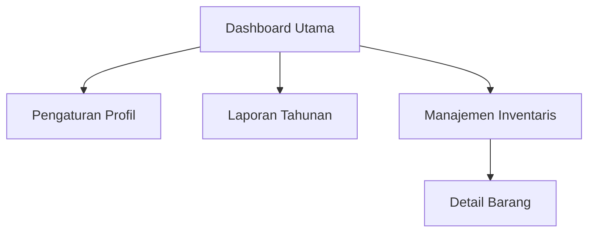
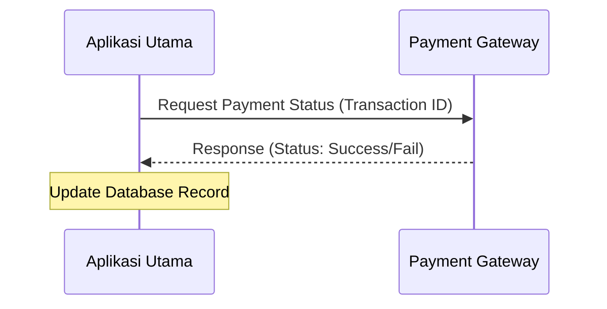
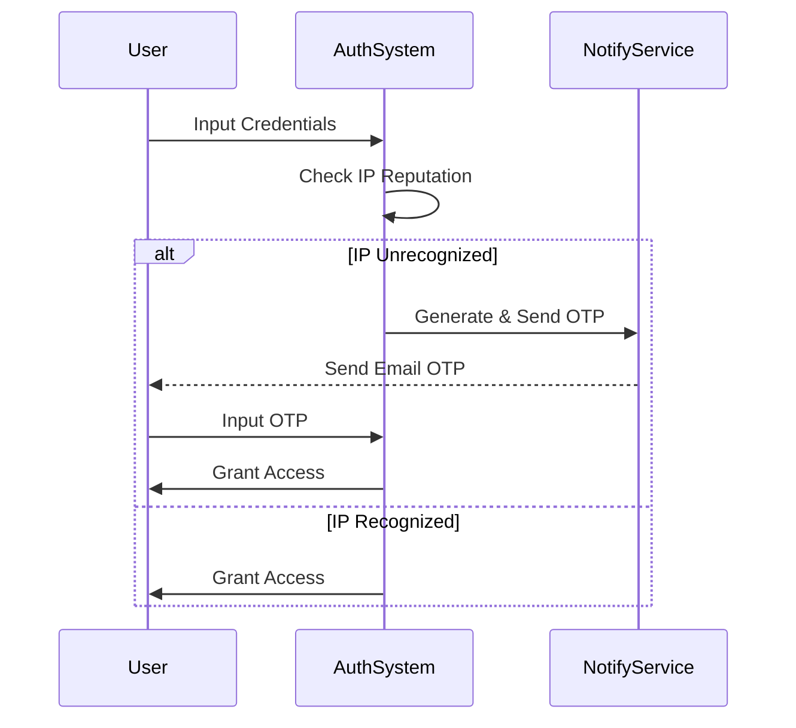
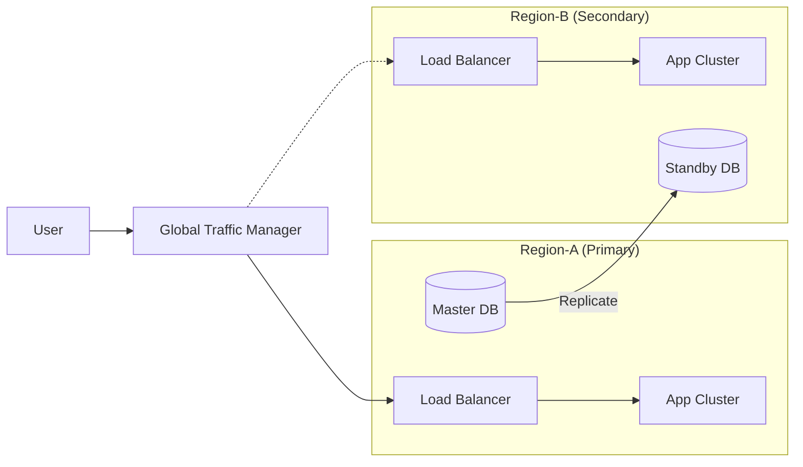

# BAB 3: REQUIREMENTS

Bagian ini menspesifikasikan seluruh persyaratan produk perangkat lunak yang dapat diverifikasi (verifiable) untuk memungkinkan proses desain dan pengujian yang akurat. Persyaratan ditulis dengan tingkat detail yang cukup untuk memandu desain tanpa ambiguitas, mencakup aspek fungsional, antarmuka, kualitas layanan, hingga batasan implementasi.

---

## 3.0 Standar dan Aturan Penulisan Persyaratan (Referensi Internal)

Bagian ini merupakan referensi teknis wajib bagi seluruh penulis dokumen SDD untuk menjamin konsistensi format dan keterlacakan (traceability). Bagian ini bersifat informatif untuk fase penyusunan dan wajib dihapus dari versi final dokumen setelah seluruh butir persyaratan selesai disusun.

**Perintah (Instructions)**

Seluruh butir persyaratan pada sub-bab berikutnya wajib mematuhi aturan identifikasi dan template yang dijelaskan di bawah ini. Pastikan setiap persyaratan bersifat testable (dapat diuji) dan hindari istilah subjektif. Gunakan kata kunci formal seperti shall (wajib), should (sangat disarankan), atau may (opsional).

Aturan Identifikasi (ID Schema):
Format ID: `REQ-[AREA]-[NNN]-[VER]`

- `AREA`: Kode area (`FUNC, INT, PERF, SEC, REL, AVAIL, OBS, COMP, INST, BUILD, DIST, MAINT, REUSE, PORT, COST, DEAD, POC, CM, ML`).
- `NNN`: Nomor urut tiga digit unik.
- `VER`: Versi persyaratan (opsional, gunakan jika ada perubahan signifikan).
- `Uniqueness`: ID bersifat unik dan tidak boleh diubah agar tetap selaras dengan skrip pengujian (test cases).

Template Penulisan Butir Persyaratan:

- ID:
- Title:
- Statement:
- Rationale:
- Acceptance Criteria:
- Verification Method: <Pilih: Test | Analysis | Inspection | Demonstration>
- More Information:

**Contoh (Example)**

| Field | Value |
| --- | --- |
| **ID** | `REQ-FUNC-001` |
| **Title** | Validasi Input Email |
| **Statement** | Sistem shall melakukan validasi format alamat email pengguna sesuai standar RFC 5322 sebelum data disimpan ke database. |
| **Rationale** | Menjamin integritas data kontak untuk kebutuhan notifikasi sistem. |
| **Acceptance Criteria** | Input tanpa karakter `'@'` atau tanpa domain akan menghasilkan pesan galat `'Invalid Email Format'`. |
| **Verification Method** | Test |
| **More Information** | - |

---

## 3.1 Antarmuka Eksternal (External Interfaces)

Definisikan seluruh titik interaksi antara sistem dengan entitas luar seperti manusia, perangkat keras, atau sistem lain.

**Perintah (Instructions)**

Bagian ini harus menyediakan definisi antarmuka yang cukup untuk implementasi dan pengujian. Jelaskan standar desain, protokol komunikasi, serta batasan integrasi yang harus dipenuhi. Gunakan dokumen kontrol antarmuka atau skema jika tersedia dan rujuk di bagian informasi tambahan. Stakeholder utama bagian ini adalah Frontend Developer, UX Designer, Hardware Engineer, dan Integration Specialist.

**Contoh (Example)**

| Field | Value |
| --- | --- |
| **ID** | `REQ-INT-001` |
| **Title** | Kepatuhan Aksesibilitas Web |
| **Statement** | Antarmuka pengguna berbasis web shall mematuhi standar WCAG 2.1 Level AA untuk seluruh elemen navigasi dan kontras warna. |
| **Rationale** | Memastikan aplikasi inklusif dan dapat digunakan oleh pengguna dengan keterbatasan fisik. |
| **Acceptance Criteria** | Hasil audit menggunakan tools aksesibilitas menunjukkan skor kepatuhan minimal 95%. |
| **Verification Method** | Inspection |
| **More Information** | `<Link ke WCAG 2.1 Guidelines>` |

---

## 3.1.1 Antarmuka Pengguna (User Interfaces)

Spesifikasi interaksi manusia dengan sistem pada level logis.

**Perintah (Instructions)**

Tentukan elemen UI, alur navigasi, dan standar yang harus diikuti seperti style guides atau accessibility guidelines. Masukkan batasan tata letak (layout), kontrol umum seperti pencarian atau bantuan, pintasan keyboard, perilaku kondisi galat (error state), kondisi data kosong (empty state), dan persyaratan lokalisasi. Simpan detail desain visual pada spesifikasi UI terpisah dan berikan referensi di sini. Kelompokkan berdasarkan kegunaan, aksesibilitas, dan kenyamanan pengguna. Jika alur navigasi kompleks, gunakan diagram Mermaid untuk memvisualisasikan hirarki menu.

**Contoh (Example)**

| Field | Value |
| --- | --- |
| **ID** | `REQ-INT-UI-002` |
| **Title** | Konsistensi Navigasi Global |
| **Statement** | Sistem shall menyediakan menu navigasi sisi kiri (sidebar) yang konsisten di seluruh halaman aplikasi dengan fitur pencarian cepat. |
| **Rationale** | Memudahkan pengguna dalam berpindah antar modul utama tanpa kehilangan konteks. |
| **Acceptance Criteria** | Menu navigasi dapat diakses dari halaman mana pun dan hasil pencarian muncul dalam waktu di bawah 1 detik. |
| **Verification Method** | Demonstration |
| **More Information** | - |

---

## 3.1.2 Antarmuka Perangkat Keras (Hardware Interfaces)

Rincikan interaksi dengan perangkat fisik dan platform.

**Perintah (Instructions)**

Spesifikasikan tipe perangkat yang didukung atau tidak didukung, sinyal data atau kontrol, karakteristik elektrik atau mekanikal jika relevan, dan protokol komunikasi yang digunakan. Sertakan ekspektasi mengenai timing (waktu), throughput (laju data), dan reliabilitas koneksi. Rujuk pada spesifikasi perangkat keras dan persyaratan sertifikasi yang berlaku untuk menjamin kompatibilitas fisik. Bagian ini krusial bagi Embedded Systems Engineer dan System Integrator.

**Contoh (Example)**

| Field | Value |
| --- | --- |
| **ID** | `REQ-INT-HW-001` |
| **Title** | Dukungan Pemindai Biometrik |
| **Statement** | Sistem shall mendukung integrasi dengan perangkat pemindai sidik jari eksternal melalui protokol USB 3.0 dengan format data ISO/IEC 19794-2. |
| **Rationale** | Menyediakan metode otentikasi fisik yang aman untuk akses terminal. |
| **Acceptance Criteria** | Data sidik jari dapat dibaca dan diverifikasi oleh sistem dalam waktu maksimal 2 detik. |
| **Verification Method** | Test |
| **More Information** | - |

---

## 3.1.3 Antarmuka Perangkat Lunak (Software Interfaces)

Definisikan integrasi dengan komponen perangkat lunak dan layanan lain.

**Perintah (Instructions)**

Sebutkan nama dan versi sistem yang terhubung, layanan atau API yang disediakan atau dibutuhkan, item data atau pesan yang dipertukarkan, serta gaya komunikasi atau protokol yang digunakan (REST, gRPC, SOAP). Jelaskan semantik batasan, galat, dan waktu tunggu (timeout). Identifikasi data bersama dan kepemilikan data tersebut. Pastikan kebijakan versi dan kompatibilitas ke belakang (backward compatibility) serta ekspektasi otentikasi untuk setiap integrasi telah ditentukan. Gunakan diagram Mermaid Sequence untuk memperjelas alur pertukaran pesan.

**Contoh (Example)**

| Field | Value |
| --- | --- |
| **ID** | `REQ-INT-SW-001` |
| **Title** | Integrasi Payment Gateway API |
| **Statement** | Sistem shall melakukan sinkronisasi status transaksi dengan Payment Gateway v2.1 menggunakan protokol HTTPS/REST dan otentikasi OAuth2. |
| **Rationale** | Menjamin akurasi status pembayaran pelanggan secara real-time. |
| **Acceptance Criteria** | Respon API diterima dalam waktu `< 500ms` dan status database diperbarui secara atomik. |
| **Verification Method** | Test |
| **More Information** | - |

---

## 3.2 Persyaratan Fungsional (Functional)

Spesifikasikan perilaku dan fungsi yang dapat diamati secara eksternal yang harus disediakan oleh perangkat lunak.

**Perintah (Instructions)**

Atur persyaratan berdasarkan fitur, use case, atau layanan. Untuk setiap fungsi, jelaskan pemicu atau input, logika pemrosesan pada level black-box, output, dan kondisi galat termasuk skenario negatif. Untuk perilaku berbasis AI, tentukan batasan determinisme (seperti suhu/temperature), kriteria penolakan, aturan keamanan, dan titik tinjauan manusia. Jika terdapat alur logika yang kompleks, wajib menyertakan diagram Mermaid yang valid untuk memvisualisasikan proses tersebut.

**Contoh (Example)**

| Field | Value |
| --- | --- |
| **ID** | `REQ-FUNC-005` |
| **Title** | Mekanisme Autentikasi Multi-Faktor (MFA) |
| **Statement** | Sistem shall mewajibkan autentikasi faktor kedua melalui One-Time Password (OTP) jika login dilakukan dari alamat IP yang tidak dikenal. |
| **Rationale** | Meningkatkan keamanan akun pengguna dari upaya akses ilegal. |
| **Acceptance Criteria** | Token OTP dikirimkan ke email terdaftar dan login diblokir jika token salah dimasukkan sebanyak 3 kali. |
| **Verification Method** | Test |
| **More Information** | - |

---

## 3.3 Kualitas Layanan (Quality of Service)

Atribut kualitas yang membatasi atau mengkualifikasi perilaku fungsional.

**Perintah (Instructions)**

Tentukan atribut kualitas yang membatasi perilaku sistem menggunakan metrik, rentang, dan kondisi spesifik. Jika suatu kualitas hanya berlaku untuk subset fungsi tertentu, rujuk ID persyaratan fungsional yang relevan. Berikan rasionalitas ketika target kualitas memengaruhi keputusan trade-off antar fungsi (misalnya: keamanan vs kecepatan). Bagian ini digunakan untuk memandu arsitek dalam memilih teknologi dan strategi infrastruktur yang tepat.

**Contoh (Example)**

| Field | Value |
| --- | --- |
| **ID** | `REQ-QOS-001` |
| **Title** | Batasan Konsumsi Memori Worker |
| **Statement** | Setiap instance worker process shall tidak menggunakan memori lebih dari 512MB dalam kondisi beban puncak. |
| **Rationale** | Mencegah kegagalan sistem akibat kehabisan memori (OOM) pada lingkungan container. |
| **Acceptance Criteria** | Pengujian beban menunjukkan penggunaan memori stabil di bawah 500MB selama 2 jam operasi. |
| **Verification Method** | Analysis |
| **More Information** | - |

---

## 3.3.1 Performa (Performance)

Ekspektasi waktu respon, throughput, dan penggunaan sumber daya.

**Perintah (Instructions)**

Spesifikasikan hubungan waktu, beban kondisi stabil maupun beban puncak, dan target performa di bawah kondisi yang diharapkan. Sertakan metode pengukuran, lingkungan pengujian, dan ambang batas penerimaan. Sebutkan batasan real-time jika ada. Pertimbangkan target skalabilitas dan asumsi perencanaan kapasitas. Pisahkan persyaratan berdasarkan subkategori waktu (latensi) dan ruang (memori, penyimpanan, bandwidth).

**Contoh (Example)**

| Field | Value |
| --- | --- |
| **ID** | `REQ-PERF-010` |
| **Title** | Latensi API Response |
| **Statement** | Sistem shall merespons permintaan baca (GET) pada endpoint utama dengan latensi p95 di bawah 200ms pada beban 1000 concurrent users. |
| **Rationale** | Menjaga pengalaman pengguna tetap responsif di bawah beban trafik normal. |
| **Acceptance Criteria** | Hasil Load Test menunjukkan rata-rata respons p95 sebesar 185ms. |
| **Verification Method** | Test |
| **More Information** | - |

---

## 3.3.2 Keamanan (Security)

Definisikan perlindungan terhadap data, identitas, dan operasional.

**Perintah (Instructions)**

Tentukan persyaratan otentikasi, otorisasi, perlindungan data (saat transit dan istirahat), audit, dan privasi. Tangani potensi penyalahgunaan dan serangan eksternal seperti injeksi atau eksfiltrasi data. Sertakan konfigurasi default yang aman dan persyaratan respon insiden. Bedakan antara kontrol wajib (Safety, Confidentiality) dan praktik yang direkomendasikan. Rujuk sub-bab 3.4 jika ada kewajiban regulasi khusus.

**Contoh (Example)**

| Field | Value |
| --- | --- |
| **ID** | `REQ-SEC-002` |
| **Title** | Enkripsi Data Sensitif at Rest |
| **Statement** | Seluruh data pribadi pengguna (PII) dalam database shall dienkripsi menggunakan algoritma AES-256 dengan manajemen kunci berbasis KMS. |
| **Rationale** | Melindungi kerahasiaan data pengguna jika terjadi kebocoran akses fisik pada media penyimpanan. |
| **Acceptance Criteria** | Data dalam kolom sensitif tidak dapat dibaca tanpa kunci dekripsi yang valid saat dilakukan inspeksi langsung pada database. |
| **Verification Method** | Inspection |
| **More Information** | - |

---

## 3.3.3 Reliabilitas (Reliability)

Kemampuan sistem untuk beroperasi secara konsisten sesuai spesifikasi.

**Perintah (Instructions)**

Tentukan metrik reliabilitas (seperti MTBF), anggaran galat (error budgets), serta teknik penanganan kegagalan seperti retry, backoff, idempotensi, dan redundansi. Definisikan kondisi di mana reliabilitas dinilai dan perilaku failover yang diharapkan. Jelaskan strategi penurunan layanan yang anggun (graceful degradation), kebijakan timeout, dan mekanisme rollback ke versi sebelumnya jika terjadi kegagalan sistemik.

**Contoh (Example)**

| Field | Value |
| --- | --- |
| **ID** | `REQ-REL-003` |
| **Title** | Idempotensi Transaksi Pembayaran |
| **Statement** | Endpoint proses pembayaran shall bersifat idempoten untuk mencegah penagihan ganda pada request yang sama dalam jendela waktu 5 menit. |
| **Rationale** | Menjamin integritas finansial dan kepercayaan pengguna terhadap sistem pembayaran. |
| **Acceptance Criteria** | Pengiriman request dengan ID transaksi yang sama berulang kali hanya menghasilkan satu kali pengurangan saldo. |
| **Verification Method** | Test |
| **More Information** | - |

---

## 3.3.4 Ketersediaan (Availability)

Target uptime sistem dan kesiapan untuk memberikan layanan.

**Perintah (Instructions)**

Definisikan target uptime sistem dan kesiapan untuk memberikan layanan. Tentukan angka target ketersediaan (misal 99.9%), jendela pemeliharaan (maintenance windows), serta mekanisme seperti checkpointing, pemulihan (recovery), dan restart otomatis. Sertakan redundansi geografis atau zona jika diperlukan untuk ketersediaan tinggi. Ekspresikan ketersediaan dalam istilah yang bermakna bagi pengguna (seperti downtime per bulan) dan kaitkan dengan SLA/SLO yang telah disepakati.

**Contoh (Example)**

| Field | Value |
| --- | --- |
| **ID** | `REQ-AVAIL-001` |
| **Title** | Target Uptime Layanan Inti |
| **Statement** | Layanan API inti shall memiliki ketersediaan minimal 99.9% setiap bulannya, tidak termasuk jendela pemeliharaan yang dijadwalkan. |
| **Rationale** | Menjamin layanan selalu tersedia bagi pengguna enterprise sesuai kontrak SLA. |
| **Acceptance Criteria** | Laporan monitoring menunjukkan total downtime tidak melebihi 43 menit dalam satu bulan. |
| **Verification Method** | Analysis |
| **More Information** | - |

---

## 3.3.5 Observabilitas (Observability)

Kemampuan memahami keadaan sistem melalui telemetri.

**Perintah (Instructions)**

Definisikan persyaratan untuk memahami keadaan dan perilaku sistem di lingkungan produksi melalui telemetri. Tentukan persyaratan untuk log, metrik, jejak (traces), dan profil sistem: mencakup event/field, batasan kardinalitas, pengambilan sampel (sampling), retensi data, dan penanganan data pribadi (PII) dalam telemetri. Spesifikasikan label standar (seperti service, versi, tenant), propagasi ID korelasi/trace, dan kebijakan redaksi data sensitif.

**Contoh (Example)**

| Field | Value |
| --- | --- |
| **ID** | `REQ-OBS-001` |
| **Title** | Propagasi Trace ID antar Layanan |
| **Statement** | Setiap request shall menyertakan `X-Correlation-ID` yang unik dan diteruskan ke seluruh microservices yang terlibat dalam alur request tersebut. |
| **Rationale** | Memudahkan penelusuran masalah (*troubleshooting*) pada sistem terdistribusi. |
| **Acceptance Criteria** | Log pada seluruh layanan menunjukkan ID yang sama untuk satu alur transaksi pengguna. |
| **Verification Method** | Test |
| **More Information** | - |

---

## 3.4 Kepatuhan (Compliance)

Persyaratan yang diturunkan dari standar eksternal, regulasi, atau kontrak hukum.

**Perintah (Instructions)**

Spesifikasikan format yang diwajibkan, konvensi penamaan, prosedur akuntansi, hak dan perjanjian pengguna, retensi catatan, dan format pelaporan wajib (misalnya GDPR, HIPAA, atau UU ITE). Untuk setiap poin kepatuhan, rujuk pada Batasan Produk atau kutip sumber otoritatif secara langsung sebagai dasar hukum persyaratan tersebut. Stakeholder utama adalah Legal Department dan Compliance Officer.

**Contoh (Example)**

| Field | Value |
| --- | --- |
| **ID** | `REQ-COMP-002` |
| **Title** | Penghapusan Data Pengguna (*Right to be Forgotten*) |
| **Statement** | Sistem shall menyediakan mekanisme bagi pengguna untuk menghapus seluruh data pribadi mereka secara permanen dalam waktu maksimal 72 jam setelah permintaan diajukan. |
| **Rationale** | Memenuhi kepatuhan terhadap regulasi perlindungan data pribadi nasional. |
| **Acceptance Criteria** | Data tidak lagi ditemukan di database utama maupun backup setelah periode 72 jam berakhir. |
| **Verification Method** | Analysis |
| **More Information** | - |

---

## 3.5 Desain dan Implementasi (Design & Implementation)

Batasan teknis atau mandat yang memengaruhi cara solusi dirancang, dibangun, dideploy, dan dipelihara.

## 3.5.1 Instalasi (Installation)

Memastikan perangkat lunak berjalan lancar di lingkungan target.

**Perintah (Instructions)**

Definisikan platform atau lingkungan yang didukung dan tidak didukung, prasyarat sistem, metode instalasi, konfigurasi lingkungan (seperti variabel lingkungan dan rahasia/secrets), serta prosedur pencopotan atau rollback. Detailkan ekspektasi otomatisasi seperti penggunaan Infrastructure as Code (IaC), skrip installer, atau container images. Simpan target skalabilitas pada bagian QoS dan fokuskan di sini pada mekanisme setup awal.

**Contoh (Example)**

| Field | Value |
| --- | --- |
| **ID** | `REQ-INST-001` |
| **Title** | Deployment berbasis Helm Chart |
| **Statement** | Seluruh komponen sistem shall dapat diinstal pada klaster Kubernetes menggunakan Helm Chart dengan konfigurasi `values.yaml` yang terpisah untuk setiap lingkungan. |
| **Rationale** | Menjamin konsistensi dan kemudahan reproduksi lingkungan antar tahap pengembangan (Dev/Prod). |
| **Acceptance Criteria** | Perintah `helm install` berhasil menyiapkan seluruh stack aplikasi tanpa intervensi manual. |
| **Verification Method** | Demonstration |
| **More Information** | - |

---

## 3.5.2 Pembangunan dan Pengiriman (Build and Delivery)

Kontrol untuk membangun, mengemas, dan mengirimkan artefak perangkat lunak.

**Perintah (Instructions)**

Definisikan bagaimana kode sumber diubah menjadi artefak yang siap dideploy. Deskripsikan ekspektasi untuk reproduktifitas build, manajemen dependensi, lisensi, manajemen konfigurasi, verifikasi artefak, dan promosi rilis. Rujuk pada sub-bab instalasi dan manajemen perubahan untuk alur kerja yang lengkap. Fokuskan pada aspek integritas dan keterlacakan build.

**Contoh (Example)**

| Field | Value |
| --- | --- |
| **ID** | `REQ-BUILD-001` |
| **Title** | Verifikasi Keamanan Dependensi |
| **Statement** | Pipeline build shall melakukan pemindaian kerentanan (*vulnerability scanning*) pada seluruh dependensi pihak ketiga dan menghentikan build jika ditemukan tingkat kritis (*critical*). |
| **Rationale** | Mencegah masuknya kerentanan keamanan yang berasal dari library eksternal ke dalam produk. |
| **Acceptance Criteria** | Laporan pemindaian terlampir pada setiap artefak build yang berhasil. |
| **Verification Method** | Test |
| **More Information** | - |

---

## 3.5.3 Distribusi (Distribution)

Penyebaran deployment, data, dan perangkat secara geografis atau organisasional.

**Perintah (Instructions)**

Spesifikasikan topologi deployment, pendekatan replikasi data dan komponen, serta batasan yang diberlakukan oleh struktur jaringan atau organisasi. Gunakan diagram Mermaid untuk memvisualisasikan topologi distribusi atau pipeline build jika diperlukan untuk memperjelas strategi implementasi distribusi sistem (misal: Multi-region atau Hybrid Cloud).

**Contoh (Example)**

| Field | Value |
| --- | --- |
| **ID** | `REQ-DIST-001` |
| **Title** | Arsitektur Multi-Region Active-Passive |
| **Statement** | Komponen inti sistem shall dideploy pada dua region cloud yang berbeda dengan sinkronisasi database asinkron untuk mendukung *Disaster Recovery*. |
| **Rationale** | Menjamin kelangsungan bisnis jika terjadi kegagalan total pada satu wilayah pusat data. |
| **Acceptance Criteria** | Waktu pemulihan (RTO) kurang dari 30 menit saat simulasi kegagalan region dilakukan. |
| **Verification Method** | Demonstration |
| **More Information** | - |

---

## 3.5.4 Maintainability (Kemudahan Pemeliharaan)

Atribut yang membuat perangkat lunak lebih mudah dimodifikasi, diperbaiki, dan dikembangkan.

**Perintah (Instructions)**

Tentukan atribut yang membuat perangkat lunak lebih mudah dimodifikasi. Definisikan ekspektasi untuk modularitas, kompleksitas kode, antarmuka, standar penulisan kode (coding standards), observabilitas yang berorientasi pada pengembang, dokumentasi teknis, dan manajemen utang teknis (technical debt). Pastikan standar ini dapat diukur menggunakan tools analisis statis kode.

**Contoh (Example)**

| Field | Value |
| --- | --- |
| **ID** | `REQ-MAINT-001` |
| **Title** | Standar Cakupan Unit Test |
| **Statement** | Seluruh modul logika bisnis baru shall memiliki cakupan unit test (*code coverage*) minimal sebesar 80%. |
| **Rationale** | Menjamin kualitas kode dan mengurangi risiko regresi saat dilakukan perubahan di masa depan. |
| **Acceptance Criteria** | Laporan cakupan kode dari pipeline CI menunjukkan angka di atas 80% untuk *pull request* yang diajukan. |
| **Verification Method** | Analysis |
| **More Information** | - |

---

## 3.5.5 Reusability (Kemampuan Penggunaan Kembali)

Mendorong pemanfaatan kembali komponen di berbagai produk atau konteks.

**Perintah (Instructions)**

Identifikasi komponen yang dimaksudkan untuk digunakan kembali dan batasan pada dependensi atau pilihan teknologi mereka. Spesifikasikan modularisasi, stabilitas API, pengemasan (packaging), dan dokumentasi yang diperlukan untuk memungkinkan penggunaan kembali oleh tim lain di dalam organisasi. Fokuskan pada pembuatan aset perangkat lunak yang agnostik terhadap proyek tertentu.

**Contoh (Example)**

| Field | Value |
| --- | --- |
| **ID** | `REQ-REUSE-001` |
| **Title** | Library Komponen UI Bersama |
| **Statement** | Komponen desain dasar (*button, input, modal*) shall dikembangkan sebagai library npm internal yang independen dari logika aplikasi utama. |
| **Rationale** | Mempercepat pengembangan UI dan menjaga konsistensi visual di seluruh ekosistem produk perusahaan. |
| **Acceptance Criteria** | Library dapat diinstal dan digunakan pada minimal dua proyek aplikasi yang berbeda tanpa modifikasi kode sumber library. |
| **Verification Method** | Demonstration |
| **More Information** | - |

---

## 3.5.6 Portabilitas (Portability)

Kemampuan sistem untuk berjalan di berbagai platform atau lingkungan dengan perubahan minimal.

**Perintah (Instructions)**

Spesifikasikan sistem operasi, arsitektur perangkat keras, penyedia cloud, atau container runtimes yang didukung dan tidak didukung. Definisikan lapisan abstraksi, kebijakan konfigurasi, dan eksternalisasi pengaturan khusus lingkungan untuk memastikan kode sumber tetap agnostik terhadap infrastruktur. Stakeholder utama adalah Arsitek dan Release Manager.

**Contoh (Example)**

| Field | Value |
| --- | --- |
| **ID** | `REQ-PORT-001` |
| **Title** | Dukungan Multi-Cloud Runtime |
| **Statement** | Aplikasi shall dikemas dalam format *OCI-compliant container* agar dapat dijalankan secara identik di AWS EKS, Google GKE, maupun Azure AKS. |
| **Rationale** | Menghindari keterpautan pada satu vendor cloud (*vendor lock-in*) dan memberikan fleksibilitas operasional. |
| **Acceptance Criteria** | Image aplikasi yang sama dapat berjalan dan lulus uji fungsional di dua provider cloud yang berbeda. |
| **Verification Method** | Demonstration |
| **More Information** | - |

---

## 3.5.7 Biaya (Cost)

Pertimbangan finansial atau target biaya yang memengaruhi desain.

**Perintah (Instructions)**

Nyatakan pertimbangan finansial atau target biaya yang memengaruhi desain. Sebutkan batasan anggaran, target biaya per transaksi, batasan lisensi, atau amplop pengeluaran cloud yang memengaruhi keputusan desain sistem. Kaitkan dengan model biaya atau asumsi TCO jika tersedia. Bedakan antara ekspektasi biaya variabel dan tetap yang berdampak pada strategi penskalaan sistem.

**Contoh (Example)**

| Field | Value |
| --- | --- |
| **ID** | `REQ-COST-001` |
| **Title** | Optimalisasi Biaya Cloud Storage |
| **Statement** | Data log yang berusia lebih dari 90 hari shall dipindahkan secara otomatis ke *cold storage* (S3 Glacier) untuk mengurangi biaya operasional. |
| **Rationale** | Menekan biaya penyimpanan infrastruktur tanpa kehilangan data historis untuk kebutuhan audit tahunan. |
| **Acceptance Criteria** | Tagihan storage menunjukkan penurunan biaya yang signifikan untuk data arsip sesuai kebijakan retensi. |
| **Verification Method** | Analysis |
| **More Information** | - |

---

## 3.5.8 Tenggat Waktu (Deadline)

Ekspektasi jadwal yang memengaruhi cakupan dan prioritas pengembangan.

**Perintah (Instructions)**

Spesifikasikan ekspektasi jadwal yang memengaruhi cakupan dan prioritas pengembangan. Tentukan milestone kunci, tanggal pengiriman, atau fase rilis. Tunjukkan dependensi antar milestone dan kriteria kesiapan yang diperlukan. Gunakan tenggat waktu ini untuk memandu pembagian persyaratan pada sub-bab 2.6 dalam dokumen SDD ini. Stakeholder utama adalah Project Manager.

**Contoh (Example)**

| Field | Value |
| --- | --- |
| **ID** | `REQ-DEAD-001` |
| **Title** | Ketersediaan MVP untuk User Acceptance Test |
| **Statement** | Seluruh fitur inti (Login, Dashboard, Input Data) shall selesai dikembangkan dan siap untuk fase UAT pada akhir Q3 2024. |
| **Rationale** | Memenuhi komitmen peluncuran produk kepada stakeholder bisnis sesuai roadmap tahunan. |
| **Acceptance Criteria** | Seluruh persyaratan berlabel `Mandatory` telah lulus verifikasi internal sebelum tanggal mulai UAT. |
| **Verification Method** | Demonstration |
| **More Information** | - |

---

## 3.5.9 Proof of Concept (PoC)

Validasi kelayakan dan kurangi risiko asumsi kritis sebelum pengiriman skala penuh.

**Perintah (Instructions)**

Definisikan tujuan, ruang lingkup, kriteria keberhasilan, dan batas waktu (timebox) untuk setiap PoC. Jelaskan apa yang akan divalidasi (teknis, kegunaan, atau performa) dan bagaimana hasilnya akan memengaruhi persyaratan atau desain akhir. Fokuskan pada tujuan validasi, bukan detail implementasi. PoC biasanya dilakukan untuk teknologi baru atau integrasi kompleks.

**Contoh (Example)**

| Field | Value |
| --- | --- |
| **ID** | `REQ-POC-001` |
| **Title** | Validasi Latensi Real-time Messaging |
| **Statement** | Sebuah PoC shall dilakukan untuk menguji apakah protokol WebSocket dapat menangani 5000 koneksi simultan dengan latensi pesan `< 100ms` di infrastruktur saat ini. |
| **Rationale** | Memastikan pilihan teknologi komunikasi dapat memenuhi kebutuhan performa fitur chat sebelum pengembangan skala besar dimulai. |
| **Acceptance Criteria** | Laporan hasil PoC memberikan data kuantitatif yang mendukung penggunaan WebSocket. |
| **Verification Method** | Analysis |
| **More Information** | - |

---

## 3.5.10 Manajemen Perubahan (Change Management)

Kendalikan bagaimana perubahan diperkenalkan dan dikomunikasikan.

**Perintah (Instructions)**

Definisikan kategori perubahan (breaking, additive, bugfix), alur kerja persetujuan, dan artefak wajib seperti changelogs atau release notes. Spesifikasikan jaminan kompatibilitas ke depan/belakang, rencana komunikasi klien, lini masa depresiasi fitur lama, serta prosedur rollout dan rollback rilis. Fokuskan pada menjaga stabilitas ekosistem pengguna saat transisi versi.

**Contoh (Example)**

| Field | Value |
| --- | --- |
| **ID** | `REQ-CM-001` |
| **Title** | Prosedur Rilis Versi API |
| **Statement** | Setiap perubahan *breaking* pada API shall disertai dengan versi *major* baru dan mempertahankan dukungan versi lama selama minimal 6 bulan. |
| **Rationale** | Memberikan waktu bagi mitra integrasi untuk memperbarui sistem mereka tanpa gangguan layanan. |
| **Acceptance Criteria** | Dokumentasi API menyediakan daftar perubahan dan panduan migrasi untuk setiap rilis versi baru. |
| **Verification Method** | Inspection |
| **More Information** | - |

---

## 3.6 Persyaratan AI/ML (AI/ML Requirements)

Persyaratan khusus bagi sistem yang mengintegrasikan model kecerdasan buatan atau pemrosesan data intensif.

## 3.6.1 Spesifikasi Model (Model Specification)

Definisikan tujuan model dan kriteria terukur untuk performa.

**Perintah (Instructions)**

Deskripsikan tujuan model, ruang lingkup, perilaku yang diharapkan, serta input dan output utama. Tentukan tujuan performa yang dapat diukur (seperti akurasi, presisi, recall). Bedakan target dasar dari peningkatan aspirasional dan tentukan toleransi drift (pergeseran performa) yang dapat diterima sebelum model harus dilatih ulang. Rujuk pada dataset validasi yang digunakan.

**Contoh (Example)**

| Field | Value |
| --- | --- |
| **ID** | `REQ-ML-MOD-001` |
| **Title** | Akurasi Model Klasifikasi Gambar |
| **Statement** | Model klasifikasi jenis barang shall memiliki skor F1-Score minimal `0.85` pada dataset validasi yang telah disepakati. |
| **Rationale** | Menjamin hasil klasifikasi otomatis cukup akurat untuk mengurangi beban verifikasi manual oleh admin. |
| **Acceptance Criteria** | Laporan evaluasi model menunjukkan nilai F1-Score sebesar `0.87` pada iterasi terakhir. |
| **Verification Method** | Analysis |
| **More Information** | - |

---

## 3.6.2 Manajemen Data (Data Management)

Integritas, keterlacakan, dan siklus hidup etis dari data ML.

**Perintah (Instructions)**

Spesifikasikan asal dataset, kepemilikan, dan kondisi persetujuan (consent). Jelaskan proses pelabelan dan kontrol kualitas, silsilah data (lineage), versi data, serta reproduktifitas alur data (pelatihan ke inferensi). Tentukan standar penyimpanan, kontrol akses, dan anonimisasi data sensitif. Stakeholder utama adalah Data Scientist dan ML Engineer.

**Contoh (Example)**

| Field | Value |
| --- | --- |
| **ID** | `REQ-ML-DATA-001` |
| **Title** | Versi Dataset Pelatihan |
| **Statement** | Setiap iterasi pelatihan model shall menggunakan snapshot dataset yang diberi versi dan disimpan dalam sistem manajemen data (misal DVC). |
| **Rationale** | Memungkinkan audit dan reproduksi hasil model jika ditemukan bias atau anomali di masa depan. |
| **Acceptance Criteria** | Tim audit dapat memanggil kembali dataset yang tepat digunakan untuk memproduksi model versi tertentu. |
| **Verification Method** | Inspection |
| **More Information** |  |

---

## 3.6.3 Guardrails (Batasan Keamanan AI)

Memastikan sistem AI beroperasi secara aman dan terprediksi.

**Perintah (Instructions)**

Spesifikasikan bagaimana sistem memvalidasi input, memfilter atau membatasi output, dan membatasi tindakan yang tersedia untuk mencegah bahaya atau penyalahgunaan. Masukkan mekanisme untuk mendeteksi dan merespons input berbahaya (prompt injection) atau kondisi operasional yang tidak aman. Rujuk pada bagian keamanan sistem (3.3.2) untuk perlindungan level sistem.

**Contoh (Example)**

| Field | Value |
| --- | --- |
| **ID** | `REQ-ML-GUARD-001` |
| **Title** | Filter Konten Output LLM |
| **Statement** | Sistem shall menerapkan lapisan filter konten (*safety layer*) untuk mendeteksi dan memblokir output yang mengandung unsur kebencian atau diskriminasi. |
| **Rationale** | Melindungi reputasi perusahaan dan memastikan sistem AI mematuhi norma etika publik. |
| **Acceptance Criteria** | Uji penetrasi menunjukkan sistem menolak memberikan jawaban untuk 100% prompt yang bersifat provokatif/berbahaya. |
| **Verification Method** | Test |
| **More Information** | - |

---

## 3.6.4 Etika (Ethics)

Keadilan, transparansi, dan akuntabilitas dalam perilaku model.

**Perintah (Instructions)**

Definisikan bagaimana pertimbangan etika akan diidentifikasi, diukur, dan dikelola. Masukkan tujuan keadilan (bias mitigation) dan ekspektasi penjelasan (explainability). Koordinasikan dengan bagian guardrails untuk mekanisme penegakan dan bagian Human-in-the-Loop untuk pengawasan manusia. Pastikan model tidak menghasilkan diskriminasi algoritmik terhadap kelompok tertentu.

**Contoh (Example)**

| Field | Value |
| --- | --- |
| **ID** | `REQ-ML-ETH-001` |
| **Title** | Mitigasi Bias Model Rekomendasi |
| **Statement** | Model rekomendasi shall menunjukkan perbedaan akurasi (*parity gap*) tidak lebih dari 5% antar kelompok demografi utama dalam dataset. |
| **Rationale** | Menjamin keadilan hasil rekomendasi dan menghindari diskriminasi algoritmik. |
| **Acceptance Criteria** | Laporan audit bias menunjukkan deviasi akurasi sebesar 2.3% pada pengujian terakhir. |
| **Verification Method** | Analysis |
| **More Information** | - |

---

## 3.6.5 Human-in-the-Loop (Intervensi Manusia)

Peran pengawasan manusia dalam keputusan yang dipengaruhi oleh AI.

**Perintah (Instructions)**

Jelaskan di mana dan bagaimana peninjauan, persetujuan, atau intervensi manusia diperlukan. Perjelas ekspektasi latensi atau throughput peninjauan, jalur eskalasi, mekanisme umpan balik, keterlacakan, dan auditabilitas tindakan manusia. Kaitkan dengan peran yang didefinisikan dalam Karakteristik Pengguna (sub-bab 2.4). Sangat penting untuk keputusan finansial atau keselamatan.

**Contoh (Example)**

| Field | Value |
| --- | --- |
| **ID** | `REQ-ML-HITL-001` |
| **Title** | Verifikasi Manual Transaksi Berisiko Tinggi |
| **Statement** | Transaksi yang ditandai oleh model deteksi anomali dengan skor kepercayaan (*confidence score*) di bawah `0.7` shall memerlukan persetujuan manual dari *Risk Officer*. |
| **Rationale** | Memastikan keputusan finansial yang kritis tetap memiliki pengawasan manusia untuk meminimalisir kesalahan AI. |
| **Acceptance Criteria** | Sistem menahan transaksi dan mengirimkan notifikasi ke dashboard admin untuk verifikasi manual. |
| **Verification Method** | Demonstration |
| **More Information** | - |

---

## 3.6.6 Siklus Hidup dan Operasi Model (Model Lifecycle and Operations)

Deployment, pemantauan, pelatihan ulang, dan penghentian model.

**Perintah (Instructions)**

Outline bagaimana model berpindah dari pengembangan ke produksi, bagaimana kinerja dan kualitas data mereka dipantau, serta bagaimana pelatihan ulang atau rollback dipicu dan dikelola. Sertakan ekspektasi untuk pengarsipan dan versi model lama guna kebutuhan audit di masa depan. Pastikan operasional model terintegrasi dengan pipeline CI/CD perusahaan.

**Contoh (Example)**

| Field | Value |
| --- | --- |
| **ID** | `REQ-ML-OPS-001` |
| **Title** | Pemantauan Model Drift secara Otomatis |
| **Statement** | Sistem shall memantau distribusi fitur input (*data drift*) secara harian dan memberikan peringatan jika terdapat deviasi statistik `> 10%` dari data pelatihan. |
| **Rationale** | Menjaga relevansi performa model terhadap perubahan pola data di dunia nyata secara proaktif. |
| **Acceptance Criteria** | Dashboard monitoring menampilkan grafik drift dan memicu alert email saat ambang batas tercapai. |
| **Verification Method** | Analysis |
| **More Information** | - |

---