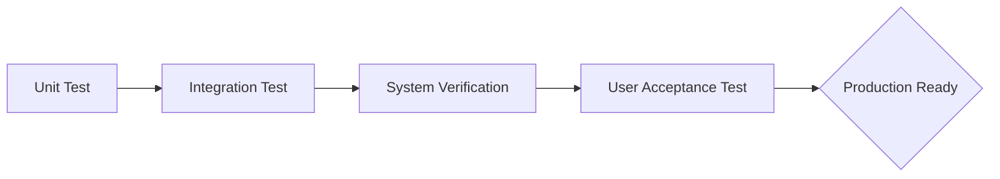

# BAB 4: VERIFICATION

Bagian ini menjelaskan bagaimana setiap persyaratan yang telah didefinisikan pada Bab 3 akan diverifikasi untuk memberikan bukti objektif mengenai kepatuhan sistem. Bab ini mencakup metodologi pengujian, matriks ketertelusuran verifikasi, serta deskripsi lingkungan dan alat yang digunakan untuk menjamin kualitas produk sebelum rilis.

---

## 4.1 Metodologi dan Pendekatan Verifikasi

**Perintah (Instructions)**

Jelaskan pendekatan umum yang digunakan untuk memvalidasi dan memverifikasi sistem. Bagian ini harus mendefinisikan berbagai metode verifikasi yang diakui dalam proyek, seperti Test (pengujian dinamis), Analysis (perhitungan/simulasi), Inspection (peninjauan visual/kode), dan Demonstration (pembuktian operasional). Sebutkan standar pengujian yang diikuti (misalnya IEEE 829 atau standar internal perusahaan) serta cakupan pengujian yang mencakup skenario positif (jalur utama) dan skenario negatif (penanganan galat). Stakeholder utama bagian ini adalah QA Engineer dan Lead Developer untuk memastikan keselarasan interpretasi metode uji. Jika terdapat siklus hidup verifikasi yang spesifik, gunakan diagram Mermaid untuk memvisualisasikannya.

**Contoh (Example)**

Sistem  diverifikasi menggunakan pendekatan berbasis risiko yang menggabungkan pengujian otomatis dan manual. Setiap butir persyaratan akan diuji melalui salah satu metode berikut:

- **Test:** Eksekusi fungsionalitas dengan input yang ditentukan untuk memvalidasi output terhadap kriteria penerimaan.
- **Analysis:** Penggunaan alat profiler atau simulasi beban untuk memverifikasi persyaratan performa dan skalabilitas.
- **Inspection:** Peninjauan kode sumber (code review) dan inspeksi dokumen arsitektur untuk kepatuhan standar keamanan.
- **Demonstration:** Menunjukkan pengoperasian fitur dalam lingkungan yang menyerupai produksi tanpa memerlukan instrumen pengujian formal.

---

## 4.2 Matriks Ketertelusuran Verifikasi (Verification Traceability Matrix)

**Perintah (Instructions)**

Sediakan tabel pemetaan yang menghubungkan setiap ID Persyaratan dari Bab 3 dengan metode verifikasi dan artefak pengujian yang relevan. Bagian ini sangat krusial bagi System Analyst dan QA Engineer untuk memastikan tidak ada persyaratan yang terlewat (gap analysis). Informasi yang wajib dicantumkan meliputi ID Persyaratan, Judul, Metode Verifikasi, Tautan ke skrip atau dokumen uji, Status saat ini, dan referensi ke bukti fisik (Evidence). Pastikan ID yang digunakan konsisten dengan Bab 3 (misal: REQ-FUNC-NNN).

**Contoh (Example)**

| ID Persyaratan | Metode Verifikasi | Tautan Skrip/Artefak | Status | Bukti (Evidence) |
| --- | --- | --- | --- | --- |
| REQ-FUNC-001 | Test | <tests/functional/auth_test.md> | Passed | <reports/run_01_auth.html> |
| REQ-SEC-003 | Analysis | <docs/security/threat_model.md> | WIP | <N/A> |
| REQ-PERF-010 | Analysis | <tests/load/api_stress_test.js> | Failed | <logs/load_test_failure.log> |
| REQ-ML-MOD-001 | Demonstration | <notebooks/eval/model_v1_eval.ipynb> | Passed | <artifacts/model_card_v1.pdf> |

---

## 4.3 Lingkungan dan Alat Verifikasi

**Perintah (Instructions)**

Rincikan spesifikasi infrastruktur dan perangkat lunak yang digunakan sebagai wadah proses verifikasi. Jelaskan perbedaan antara lingkungan pengembangan (Dev), lingkungan pengujian (Staging/QA), dan lingkungan simulasi produksi. Cantumkan alat bantu (tools) yang digunakan seperti framework pengujian (Jest, PyTest, Selenium), alat pemantauan performa (JMeter, Locust), serta alat analisis statis (SonarQube). Sebutkan pula persyaratan data uji (test data), termasuk kebutuhan akan data yang dianonimkan (masked data) untuk menjaga privasi. Stakeholder utama bagian ini adalah DevOps Engineer dan QA Specialist.

**Contoh (Example)**

Proses verifikasi dilakukan pada klaster Kubernetes khusus pengujian dengan spesifikasi yang identik dengan lingkungan produksi dalam skala 1:4. Alat yang digunakan meliputi:

- **Framework:** untuk pengujian logika bisnis dan untuk pengujian antarmuka pengguna (UI).
- **Infrastruktur:** dengan dataset yang telah dianonimkan dari snapshot database produksi tanggal .
- **CI/CD:** yang secara otomatis menjalankan pipeline pengujian pada setiap pull request ke cabang 'main'.

---

## 4.4 Verifikasi Khusus: QoS dan Model AI/ML

**Perintah (Instructions)**

Definisikan prosedur khusus untuk memverifikasi persyaratan non-fungsional (Quality of Service) dan perilaku model AI/ML yang mungkin bersifat non-deterministik. Untuk QoS, jelaskan bagaimana ambang batas (thresholds) latensi dan throughput diverifikasi menggunakan canary metrics. Untuk AI/ML, rujuk pada penggunaan Model Cards dan dataset validasi khusus. Tekankan pada aspek reproduktifitas hasil pengujian dan manajemen versi model. Bagian ini digunakan oleh Data Scientist dan Performance Engineer untuk memastikan sistem tetap stabil dan akurat di bawah kondisi beban nyata.

**Contoh (Example)**

Verifikasi model AI dilakukan melalui proses evaluasi batch terhadap dataset 'Hold-out' versi <v2.1>.

- **Akurasi Model:** Skor F1 diverifikasi menggunakan skrip <eval_metrics.py> dengan toleransi deviasi sebesar +/- 2%.
- **Performance (Latency):** Verifikasi dilakukan dengan mengukur waktu inferensi pada beban 50 request per second (RPS) menggunakan .
- **Reproduktifitas:** Setiap laporan verifikasi wajib mencantumkan 'Model Hash' dan 'Dataset Version ID' untuk menjamin auditabilitas hasil.

---