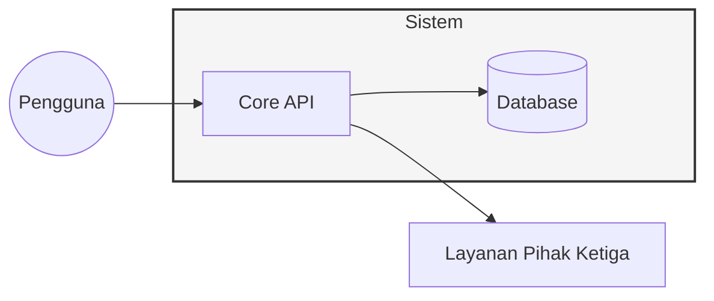

# BAB 1: PENDAHULUAN (INTRODUCTION)

Bagian ini memberikan gambaran umum mengenai dokumen dan mengorientasikan pembaca terhadap sistem yang sedang dirancang. Pendahuluan ini merangkum tujuan dokumen, ruang lingkup subjek, istilah teknis, serta referensi yang mendasari keputusan desain tanpa masuk ke detail teknis implementasi.

---

## 1.1 Tujuan Dokumen (Document Purpose)

**Perintah (Instructions)**

Jelaskan secara eksplisit mengapa dokumen Software Design Document (SDD) ini dibuat dan apa yang ingin dicapai melalui dokumentasi ini. Sebutkan audiens utama yang dituju, seperti Software Architect untuk validasi struktur, Backend/Frontend Engineer untuk panduan implementasi, serta tim DevOps dan QA untuk perencanaan infrastruktur dan pengujian. Tekankan peran dokumen ini dalam siklus hidup pengembangan perangkat lunak (SDLC), misalnya sebagai 'blue print' teknis yang menjembatani kebutuhan bisnis dengan kode program. Sebutkan juga dokumen terkait lainnya seperti Business Requirement Document (BRD) atau Software Requirement Specification (SRS) yang menjadi landasan desain ini.

**Contoh (Example)**

Dokumen SDD ini disusun untuk mendefinisikan desain teknis dan arsitektur dari sistem . Tujuan utamanya adalah menyediakan panduan komprehensif bagi tim Engineering dalam mengimplementasikan komponen perangkat lunak serta bagi tim Maintenance dalam memahami struktur sistem untuk pemeliharaan jangka panjang. Dokumen ini mentransformasikan persyaratan fungsional dari  menjadi spesifikasi teknis yang dapat dieksekusi, memastikan seluruh stakeholder memiliki pemahaman yang selaras mengenai topologi dan logika sistem.

---

## 1.2 Ruang Lingkup Subjek (Subject Scope)

**Perintah (Instructions)**

Identifikasi sistem yang sedang dirancang berdasarkan nama dan versi rilisnya. Jelaskan dalam paragraf terstruktur mengenai tujuan utama sistem, kapabilitas kunci, dan hasil akhir yang diharapkan. Sangat penting untuk mendefinisikan batasan desain secara jelas dengan mencantumkan apa yang termasuk dalam cakupan (inclusions) dan apa yang berada di luar cakupan (exclusions), terutama jika sistem ini merupakan bagian dari ekosistem enterprise yang lebih besar. Jika terdapat interaksi antar sistem, gunakan diagram Mermaid untuk memvisualisasikan batasan sistem (system boundary) agar arsitek dan pengembang memahami titik integrasi dan tanggung jawab komponen.

**Contoh (Example)**

Sistem  versi <1.0.0> adalah platform  yang bertujuan untuk . Ruang lingkup desain ini mencakup arsitektur microservices, skema database relasional, dan integrasi API Gateway. Desain ini tidak mencakup konfigurasi hardware server fisik atau pengelolaan jaringan internal di sisi penyedia cloud. Fokus utama adalah pada penyediaan layanan  yang skalabel dan aman.

---

## 1.3 Definisi, Akronim, dan Singkatan (Definitions, Acronyms, and Abbreviations)

**Perintah (Instructions)**

Sediakan glosarium yang berisi istilah domain spesifik, akronim teknis, dan singkatan yang digunakan di seluruh dokumen SDD ini. Bagian ini bertujuan untuk menghindari ambiguitas interpretasi antara stakeholder teknis dan non-teknis. Masukkan istilah yang krusial terhadap pemahaman desain, seperti nama framework tertentu, pola arsitektur, atau istilah bisnis yang unik. Pastikan entri disusun berdasarkan urutan abjad (alphabetical order) untuk memudahkan pencarian oleh pembaca.

**Contoh (Example)**

| Istilah | Definisi |
| --- | --- |
| API | Application Programming Interface - Kumpulan definisi dan protokol untuk membangun dan mengintegrasikan perangkat lunak aplikasi. |
| MSDD | Master Software Design Document - Dokumen desain tingkat tinggi yang mengoordinasikan berbagai sub-sistem. |
| RBAC | Role-Based Access Control - Metode pengaturan akses sistem berdasarkan peran pengguna dalam organisasi. |
| SDD | Software Design Document - Dokumen yang mendeskripsikan tujuan, arsitektur, dan detail teknis perangkat lunak. |

---

## 1.4 Referensi (References)

**Perintah (Instructions)**

Daftarkan semua sumber eksternal yang menjadi referensi baik secara normatif (mengikat secara hukum/teknis) maupun informatif (sebagai panduan tambahan). Referensi dapat berupa standar industri (ISO/IEEE), dokumen persyaratan bisnis (BRD), spesifikasi antarmuka dari pihak ketiga, panduan gaya UI/UX, atau catatan keputusan arsitektur (ADR). Untuk setiap entri, cantumkan judul dokumen, pemilik atau penulis, versi, tanggal, dan lokasi akses atau URL yang stabil. Gunakan jalur repositori internal yang konsisten agar tim DevOps dapat menelusuri sumber kebenaran data (source of truth) dengan mudah.

**Contoh (Example)**

| Dokumen | Pemilik/Penulis | Versi/Tanggal | Lokasi/URL |
| --- | --- | --- | --- |
| Software Requirements Specification |  | v2.1 / 2024 |  |
| Cloud Architecture Best Practices |  | v1.5 / 2023 |  |
| RFC 7519 (JSON Web Token) |  | 2015 | https://tools.ietf.org/html/rfc7519 |

---

## 1.5 Ikhtisar Dokumen (Document Overview)

**Perintah (Instructions)**

Sediakan panduan singkat mengenai struktur dokumen SDD agar pembaca dapat menavigasi informasi dengan cepat sesuai dengan kebutuhan peran mereka. Ringkas isi dari setiap bab utama, mulai dari deskripsi arsitektur, keputusan desain, detail komponen, hingga lampiran teknis. Sebutkan konvensi penulisan yang digunakan (jika ada) serta jelaskan bagaimana mekanisme pembaruan dokumen dan riwayat revisi dikelola di dalam repositori proyek. Bagian ini membantu pembaca memahami alur logika dokumen dalam 3 hingga 5 kalimat.

**Contoh (Example)**

Dokumen ini terbagi menjadi lima bab utama yang mencakup aspek strategis hingga taktis. Bab 2 membahas arsitektur sistem secara makro, sementara Bab 3 merinci desain komponen dan skema data. Bab 4 berfokus pada protokol verifikasi, dan Bab 5 berisi lampiran teknis tambahan. Seluruh pembaruan dokumen dilakukan melalui sistem kendali versi  dengan prosedur peninjauan oleh  sebelum dipublikasikan sebagai rilis desain resmi.

---