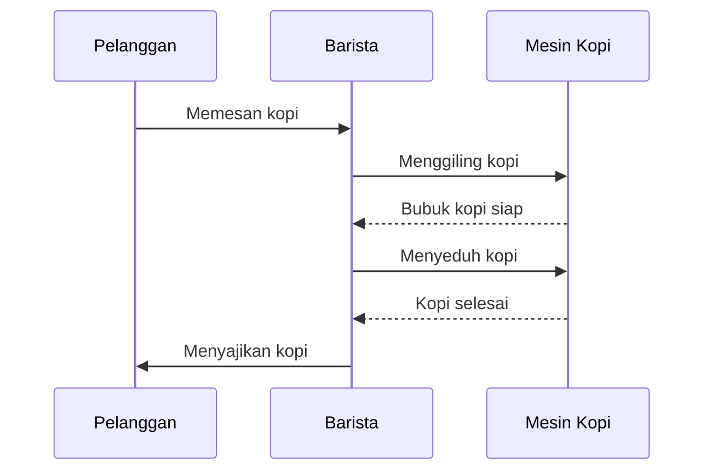

# 2. Design Overview

## 2.1 Stakeholder Concerns
Identifikasi tipe stakeholder (misal: pengguna, pengembang, operator) dan tuliskan apa yang menjadi fokus utama mereka terkait desain (misal: ketersediaan sistem, kemudahan pemeliharaan, atau mitigasi risiko). Hubungkan kekhawatiran tersebut dengan sudut pandang (viewpoint) desain yang ada dalam dokumen ini.

## 2.2 Selected Viewpoints
Tentukan dan deskripsikan sudut pandang (viewpoints) yang dipilih untuk menjawab kekhawatiran stakeholder pada poin 2.1. Gunakan panduan berikut untuk mengisi setiap sub-bab:

### 2.2.1 Context
Gambarkan sistem sebagai "kotak hitam". Identifikasi batasan sistem, aktor lingkungan (pengguna, sistem eksternal), dan layanan yang ditawarkan (use cases). Gunakan bahasa visual seperti UML Use Case Diagram atau C4 Context Diagram.

### 2.2.2 Composition
Tuliskan bagaimana sistem disusun dari bagian-bagian utama (sub-sistem, komponen, atau modul). Jelaskan alokasi tanggung jawab dan bagaimana integrasinya dilakukan. Gunakan UML Component Diagram atau Deployment Diagram.

### 2.2.3 Logical
Gambarkan struktur desain statis dalam hal tipe dan implementasinya (class, interface) serta hubungannya. Fokuskan pada enkapsulasi dan dependensi antar entitas menggunakan UML Class Diagram. 

# Diagram Proses Pembuatan Kop (contoh diagram)

### 2.2.4 Physical
Tuliskan detail infrastruktur fisik sistem, termasuk konfigurasi perangkat keras, topologi jaringan, dan batasan fisik. Gunakan Hardware Block Diagram atau Cloud Infrastructure Diagram.

### 2.2.5 Structure
Dokumentasikan organisasi internal komponen, termasuk port dan konektor yang digunakan. Gunakan UML Composite Structure atau C4 Container Diagram.

### 2.2.6 Dependency
Tunjukkan bagaimana elemen desain saling terhubung dan mengakses satu sama lain (import, service, atau build-time). Gambarkan arah ketergantungan (misal: "uses", "requires") menggunakan Dependency Graph.

### 2.2.7 Information
Modelkan struktur data persisten, relasinya, serta mekanisme akses dan pengelolaannya. Gunakan Entity-Relationship Diagram (ERD) atau Logical Data Model.

### 2.2.8 Interface
Spesifikasikan antarmuka yang terlihat secara eksternal antar komponen atau dengan sistem luar. Masukkan spesifikasi API, IDL, atau signature method.

### 2.2.9 Interaction
Gambarkan bagaimana entitas berkolaborasi pada saat runtime melalui pesan (siapa bicara kepada siapa, urutan, dan kondisinya). Masukkan skenario "happy-path" dan "failure-path" menggunakan UML Sequence Diagram.

### 2.2.10 Algorithm
Tuliskan detail logika pemrosesan internal untuk operasi yang kritis atau baru. Gunakan Pseudocode, Flowchart, atau tabel keputusan matematika. Hubungkan setiap algoritma dengan komponen pemiliknya.

### 2.2.11 State Dynamics
Tuliskan bagaimana status sistem atau komponen berubah sebagai respons terhadap event/stimulus. Gunakan UML State Machine Diagram atau State Transition Table.

### 2.2.12 Concurrency
Deskripsikan bagaimana desain menangani paralelisme, sinkronisasi, koordinasi antar entitas, dan kontrol penguncian (locking). Gunakan UML Activity Diagram atau Actor Model.

### 2.2.13 Patterns
Identifikasi ide desain yang digunakan kembali seperti design patterns, architectural styles, atau framework templates yang membatasi atau memandu struktur sistem.

### 2.2.14 Deployment
Gambarkan pemetaan entitas perangkat lunak ke lingkungan eksekusi fisik (apa yang berjalan di mana). Gunakan UML Deployment Diagram atau Infrastructure-as-Code topology.

### 2.2.15 Resources
Tuliskan spesifikasi penggunaan dan pengelolaan sumber daya yang terbatas (memori, bandwidth, thread, file handles). Jelaskan strategi manajemen sumber daya dan potensi hambatan (bottleneck).