# BAB 2: DESIGN OVERVIEW

Bagian ini memberikan deskripsi mengenai sifat dan pendekatan arsitektur serta desain sistem secara keseluruhan. Bab ini menjabarkan bagaimana kepentingan pemangku kepentingan diakomodasi melalui berbagai sudut pandang desain yang dipilih untuk merepresentasikan solusi teknis.

## 2.1 Kepentingan Pemangku Kepentingan (Stakeholder Concerns)

Mendefinisikan pemangku kepentingan utama dan kepentingan mereka yang terkait dengan desain sistem.

**Perintah (Instructions)**

Identifikasi jenis pemangku kepentingan (seperti pengguna, pengembang, operator, atau pemilik bisnis). Jelaskan kepentingan utama mereka terhadap desain sistem (misalnya ketersediaan, kemudahan pemeliharaan, mitigasi risiko, atau skalabilitas). Hubungkan kepentingan tersebut dengan elemen desain atau sudut pandang (viewpoints) yang ada dalam dokumen ini untuk menunjukkan bagaimana kekhawatiran mereka dijawab. Bagian ini digunakan oleh Project Manager dan Software Architect untuk memastikan semua kebutuhan non-fungsional dan operasional telah dipertimbangkan dalam desain.

**Contoh (Example)**

| Pemangku Kepentingan | Kepentingan Utama (Concerns) | Sudut Pandang Terkait |
| --- | --- | --- |
|  | Skalabilitas dan integrasi antar modul. | Composition, Dependency |
|  | Topologi infrastruktur dan strategi deployment. | Physical, Deployment |
|  | Perlindungan data dan integritas transaksi. | Information, Interface |
|  | Pola abstraksi kode dan penggunaan kembali komponen. | Logical, Patterns |

## 2.2 Sudut Pandang yang Dipilih (Selected Viewpoints)

Mendefinisikan perspektif yang digunakan untuk merepresentasikan dan menalar desain sistem.

**Perintah (Instructions)**

Identifikasi dan deskripsikan sudut pandang (viewpoints) yang dipilih untuk menjawab kepentingan pemangku kepentingan yang telah diidentifikasi pada bagian 2.1. Setiap sudut pandang harus menangani kekhawatiran spesifik dan menggunakan bahasa visualisasi yang standar (seperti UML, C4, atau Sequence Diagram). Jelaskan secara singkat alasan pemilihan sudut pandang tersebut dan kepentingan mana yang mereka wakili. Bagian ini berfungsi sebagai peta navigasi bagi pembaca teknis (Technical Writer, Architect) untuk memahami alur dokumentasi desain.

**Contoh (Example)**

Sistem  didokumentasikan menggunakan sudut pandang berikut untuk memastikan transparansi arsitektur:

1. Konteks: Menjelaskan batas sistem bagi pengguna dan sistem eksternal.
2. Komposisi: Menggambarkan struktur modular untuk tim pengembang.
3. Informasi: Detail skema data untuk DBA dan Analis.
4. Interaksi: Alur pesan runtime untuk pemecahan masalah (troubleshooting).

## 2.2.1 Konteks (Context)

Mendefinisikan sistem sebagai kotak hitam (black box), mengidentifikasi batasan sistem dan lingkungannya.

**Perintah (Instructions)**

Gambarkan sistem dalam lingkungan operasionalnya. Identifikasi batasan sistem, aktor lingkungan (pengguna atau sistem eksternal), dan layanan yang ditawarkan (use cases). Gunakan diagram Mermaid tipe Graph atau C4 Context untuk memvisualisasikan hubungan ini. Penulisan harus berfokus pada interaksi level tinggi tanpa masuk ke detail internal. Stakeholder utama adalah System Analyst dan Business Owner untuk memvalidasi cakupan solusi.

**Contoh (Example)**

Sistem  berinteraksi dengan tiga aktor eksternal utama untuk memproses transaksi finansial.

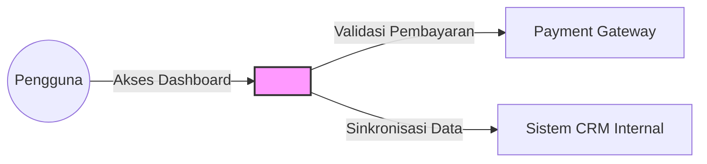

## 2.2.2 Komposisi (Composition)

Menjelaskan bagaimana sistem disusun secara rekursif dari bagian-bagian utama (subsistem, komponen, atau modul).

**Perintah (Instructions)**

Identifikasi elemen desain utama dan alokasi tanggung jawab di setiap bagian. Jelaskan modularitas (penggunaan kembali, keputusan beli vs buat) serta strategi integrasi antar komponen. Gunakan diagram Mermaid tipe Class (untuk struktur paket) atau Graph untuk dekomposisi hierarkis. Fokuskan pada bagaimana komponen-komponen tersebut bekerja sama dan di mana komponen pihak ketiga terintegrasi. Bagian ini sangat penting bagi Backend/Frontend Engineer sebagai panduan pengorganisasian kode.

**Contoh (Example)**

Sistem didekomposisi menjadi tiga layanan utama yang berkomunikasi melalui API Gateway internal.

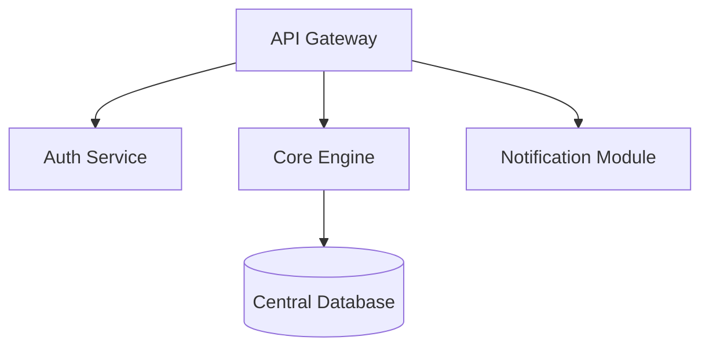

## 2.2.3 Logis (Logical)

Menangkap struktur desain statis sistem dalam hal tipe dan implementasinya (kelas, antarmuka) serta hubungannya.

**Perintah (Instructions)**

Jelaskan abstraksi desain yang digunakan dan bagaimana abstraksi tersebut diimplementasikan. Fokuskan pada enkapsulasi dan ketergantungan antar entitas statis. Gunakan diagram Mermaid tipe Class Diagram untuk menunjukkan hubungan seperti asosiasi, pewarisan, dan implementasi antarmuka. Sudut pandang ini melengkapi sudut pandang Komposisi dengan memperjelas kontrak dan tipe data yang mendasarinya. Stakeholder utama adalah Software Architect dan Lead Developer.

**Contoh (Example)**

Struktur entitas inti menggunakan pola Repository untuk memisahkan logika bisnis dari akses data.

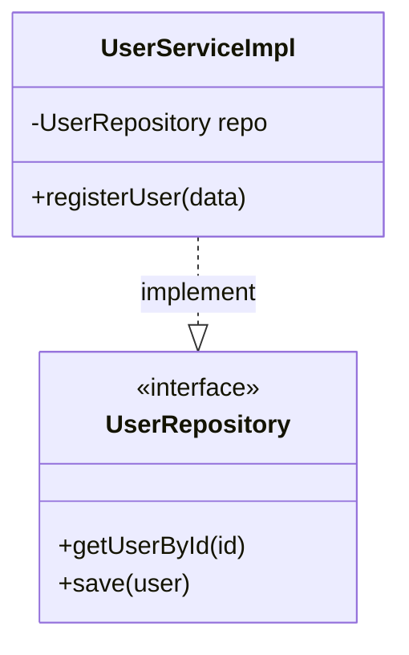

## 2.2.4 Fisik (Physical)

Menggambarkan infrastruktur sistem yang nyata dan berwujud.

**Perintah (Instructions)**

Gambarkan konfigurasi perangkat keras, topologi fisik, dan batasan fisik yang ada pada lingkungan target. Jelaskan tata letak jaringan, rak server, atau diagram infrastruktur cloud yang digunakan. Bagian ini harus memberikan gambaran platform tempat perangkat lunak akan dijalankan. Stakeholder utama adalah DevOps Engineer dan System Administrator untuk perencanaan kapasitas dan manajemen aset.

**Contoh (Example)**

Sistem dideploy pada infrastruktur cloud menggunakan zona ketersediaan (Availability Zones) ganda.

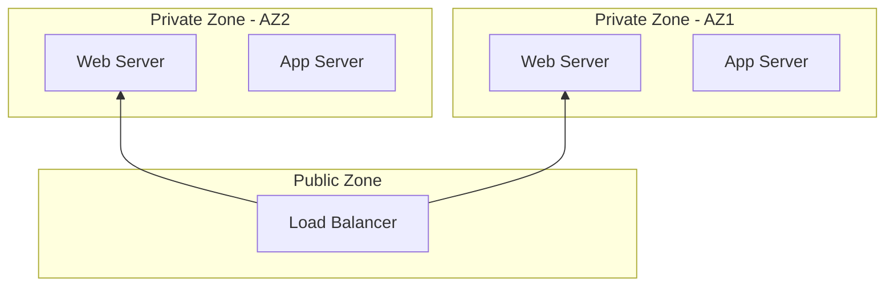

## 2.2.5 Struktur (Structure)

Mendokumentasikan organisasi internal komponen beserta bagian-bagiannya, port, dan konektor.

**Perintah (Instructions)**

Jelaskan komposisi internal dari entitas yang kompleks dan bagaimana bagian-bagian tersebut saling terhubung melalui antarmuka internal (ports). Fokuskan pada penggunaan kembali komponen halus (fine-grained) dan mekanisme konektor yang digunakan untuk komunikasi internal. Gunakan diagram Mermaid tipe Graph atau Class untuk menunjukkan struktur komposit ini. Bagian ini digunakan oleh Backend Engineer untuk memahami desain detail di dalam satu layanan/modul.

**Contoh (Example)**

Modul  memiliki struktur internal yang memisahkan validator transaksi dengan komunikator eksternal.

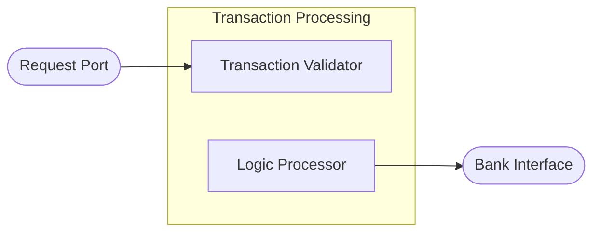

## 2.2.6 Ketergantungan (Dependency)

Menunjukkan bagaimana elemen desain saling terhubung dan mengakses satu sama lain secara direktional.

**Perintah (Instructions)**

Gambarkan hubungan antar elemen baik pada saat build-time (import) maupun runtime (service calls). Jelaskan tingkat kopling (coupling) dan lakukan analisis dampak perubahan (change impact analysis). Gunakan diagram Mermaid tipe Graph dengan panah direktional yang dilabeli dengan deskripsi seperti "uses", "requires", atau "provides". Sudut pandang ini krusial untuk QA dan DevOps dalam memahami prioritas integrasi.

**Contoh (Example)**

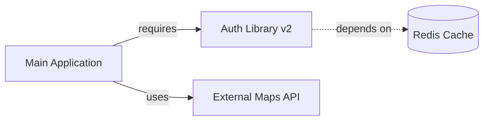

## 2.2.7 Informasi (Information)

Memodelkan struktur data persisten, hubungannya, serta mekanisme akses dan manajemen data.

**Perintah (Instructions)**

Gambarkan struktur data dan semantik data yang akan disimpan secara permanen. Jelaskan integritas data, metadata, dan skema manajemen data (seperti skema database relasional atau dokumen NoSQL). Gunakan diagram Mermaid tipe ER Diagram (ERD). Pastikan penamaan selaras dengan sudut pandang Logis untuk menjaga konsistensi tipe data. Stakeholder utama adalah Database Administrator (DBA) dan System Analyst.

**Contoh (Example)**

Skema database untuk manajemen pesanan memiliki relasi satu-ke-banyak antara pengguna dan transaksi.

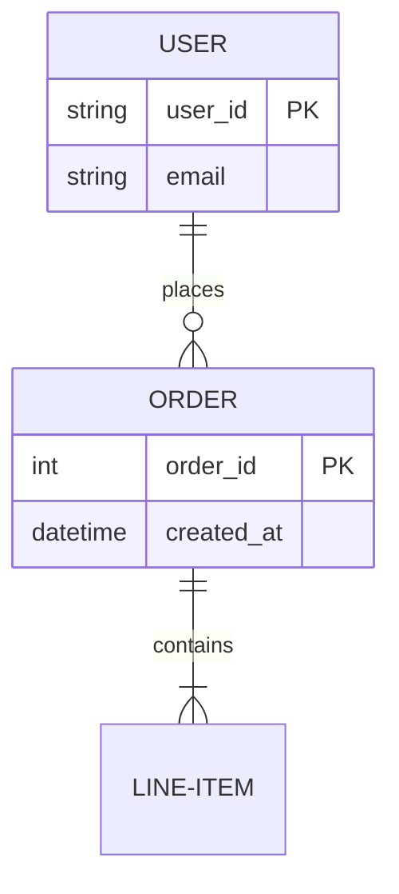

## 2.2.8 Antarmuka (Interface)

Menspesifikasikan antarmuka yang terlihat secara eksternal di antara komponen atau sistem luar.

**Perintah (Instructions)**

Definisikan kontrak antarmuka untuk interoperabilitas dan enkapsulasi. Spesifikasikan tanda tangan fungsi/metode (signatures), spesifikasi API (seperti OpenAPI/Swagger), IDL, atau protokol komunikasi. Jelaskan risiko integrasi yang mungkin muncul dari definisi kontrak ini. Penulisan harus formal dan memberikan detail teknis mengenai input, output, dan parameter wajib. Stakeholder utama adalah Frontend Engineer dan Integration Specialist.

**Contoh (Example)**

Endpoint Autentikasi Pengguna:

- Metode: `POST`
- Jalur: `/api/v1/login`
- Payload: `{ "username": <string>, "password": <string> }`
- Respon Sukses: `200 OK` dengan token JWT.

## 2.2.9 Interaksi (Interaction)

Menggambarkan bagaimana entitas berkolaborasi pada saat runtime melalui pertukaran pesan.

**Perintah (Instructions)**

Visualisasikan siapa yang berbicara kepada siapa, dalam urutan apa, dan di bawah kondisi apa. Jelaskan pengurutan pesan (sequencing), waktu (timing), sinkronisasi, dan propagasi galat (error). Gunakan diagram Mermaid tipe Sequence Diagram. Berikan skenario "jalur sukses" (happy-path) dan "jalur gagal" (failure-path). Bagian ini sangat penting untuk pengembang dalam memahami logika alur kerja terdistribusi.

**Contoh (Example)**

Skenario proses checkout oleh pengguna:

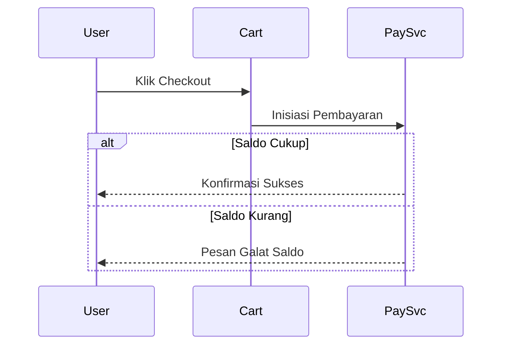

## 2.2.10 Algoritma (Algorithm)

Mendeskripsikan logika pemrosesan internal dari suatu operasi secara mendalam.

**Perintah (Instructions)**

Jelaskan langkah-langkah, keputusan, perulangan, dan penanganan galat pada algoritma yang kritis atau baru dalam desain. Fokuskan pada kompleksitas komputasi, logika ruang-waktu, performa, dan reproduktifitas. Gunakan diagram Mermaid tipe Flowchart atau Pseudocode. Hubungkan algoritma dengan kelas atau komponen pemiliknya. Bagian ini digunakan oleh Backend Engineer dan Performance Engineer untuk optimasi kode.

**Contoh (Example)**

Logika  pada integrasi API pihak ketiga:

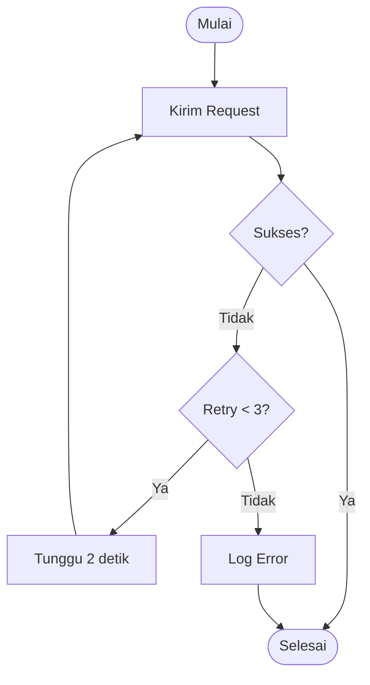

## 2.2.11 Dinamika State (State Dynamics)

Menjelaskan bagaimana status sistem atau komponen berevolusi sebagai respon terhadap peristiwa seiring waktu.

**Perintah (Instructions)**

Detailkan mode/state, transisi, event/pemicu, guard, dan efek masuk/keluar (entry/exit effects). Gunakan diagram Mermaid tipe State Diagram. Sudut pandang ini melengkapi sudut pandang Interaksi/Algoritma ketika perilaku sistem sangat bergantung pada status saat ini. Stakeholder utama adalah QA Engineer untuk memvalidasi siklus hidup objek (object lifecycle).

**Contoh (Example)**

Siklus hidup pesanan (Order Lifecycle):

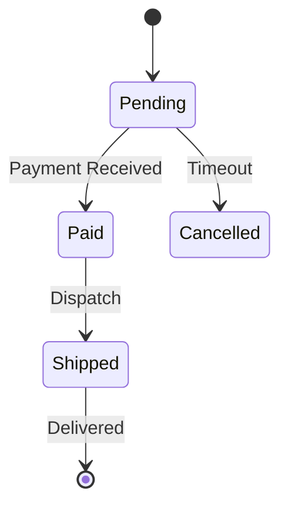

## 2.2.12 Konkurensi (Concurrency)

Menjelaskan bagaimana desain menangani paralelisme, sinkronisasi, dan koordinasi antar entitas konkuran.

**Perintah (Instructions)**

Gambarkan struktur thread/proses, mekanisme penguncian (locking), kontrol konkurensi, pengurutan peristiwa, dan pencegahan kondisi balapan (race conditions). Gunakan diagram Mermaid tipe Activity Diagram atau Sequence Diagram dengan anotasi wilayah paralel. Sudut pandang ini digunakan ketika sinkronisasi adalah kekhawatiran utama yang dapat mengacaukan tampilan dinamis lainnya. Stakeholder utama adalah Performance Engineer.

**Contoh (Example)**

Proses sinkronisasi background data:

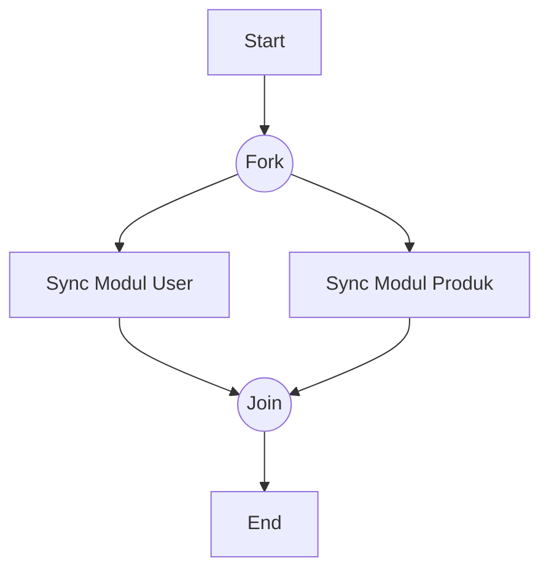

## 2.2.13 Pola (Patterns)

Mengidentifikasi ide desain dan kolaborasi yang dapat digunakan kembali (reusable).

**Perintah (Instructions)**

Identifikasi pola desain (design patterns), gaya arsitektur (architectural styles), atau template framework yang memandu struktur dan perilaku sistem. Dokumentasikan pola mana yang diterapkan dan di bagian mana pola tersebut digunakan. Gunakan diagram Mermaid tipe Class atau Package untuk menunjukkan struktur berbasis template. Bagian ini memastikan konsistensi gaya arsitektur di seluruh tim pengembangan.

**Contoh (Example)**

Sistem menggunakan gaya  dengan pola  untuk distribusi event.

- Lokasi: Paket `com.enterprise.events`
- Tujuan: Menjamin modul notifikasi tetap independen dari modul inti bisnis.

## 2.2.14 Pengiriman (Deployment)

Menggambarkan bagaimana entitas perangkat lunak dipetakan ke lingkungan eksekusi fisik.

**Perintah (Instructions)**

Jelaskan alokasi komponen ke node fisik, topologi deployment, mekanisme komunikasi antar node, distribusi, replikasi, dan penskalaan. Gunakan diagram Mermaid tipe Deployment atau Graph. Sertakan tingkatan lingkungan (tier) dan urutan deployment jika relevan. Stakeholder utama adalah DevOps Engineer dan Arsitek untuk perencanaan ketersediaan tinggi (High Availability).

**Contoh (Example)**

Pemetaan container ke klaster Kubernetes:

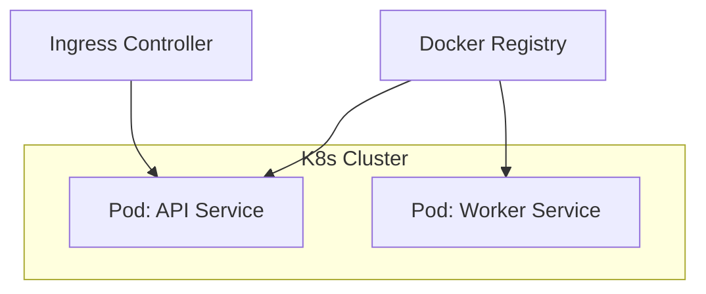

## 2.2.15 Sumber Daya (Resources)

Menspesifikasikan penggunaan dan pengelolaan sumber daya yang bersama atau terbatas.

**Perintah (Instructions)**

Jelaskan strategi pemanfaatan dan alokasi sumber daya seperti memori, bandwidth, thread, atau file handles. Identifikasi potensi kemacetan (bottlenecks), strategi manajemen sumber daya, dan prioritas akses. Hubungkan sudut pandang ini dengan Konkurensi (waktu) dan Deployment (penempatan) untuk gambaran runtime yang lengkap. Stakeholder utama adalah Performance Engineer dan System Administrator.

**Contoh (Example)**

| Sumber Daya | Batas Maksimum | Strategi Manajemen |
| --- | --- | --- |
|  | 4 GB | Garbage Collection G1, Monitoring Alert > 80% |
|  | 100 Pool | Connection Pooling (HikariCP) |
|  | 50 Threads | Fixed Thread Pool dengan Blocking Queue |