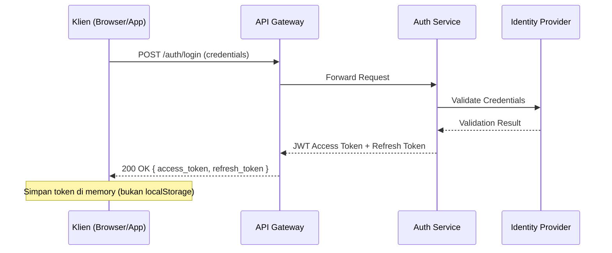
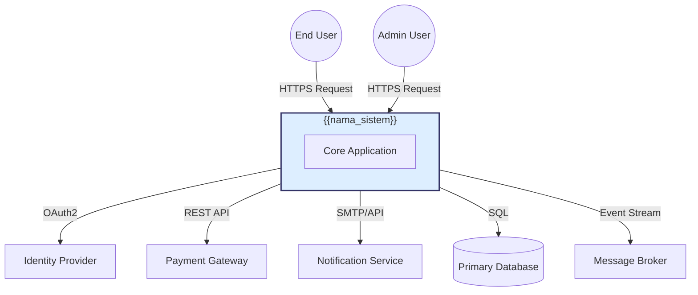
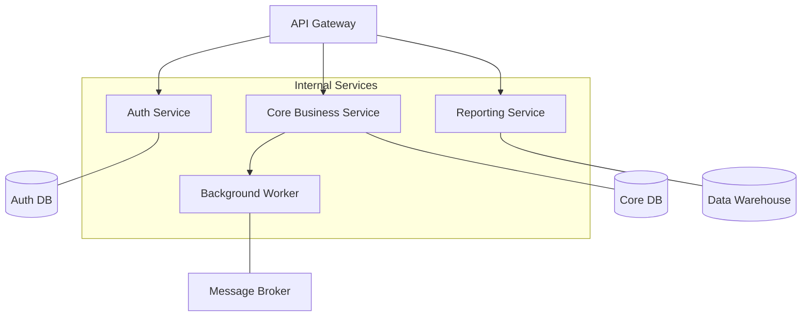
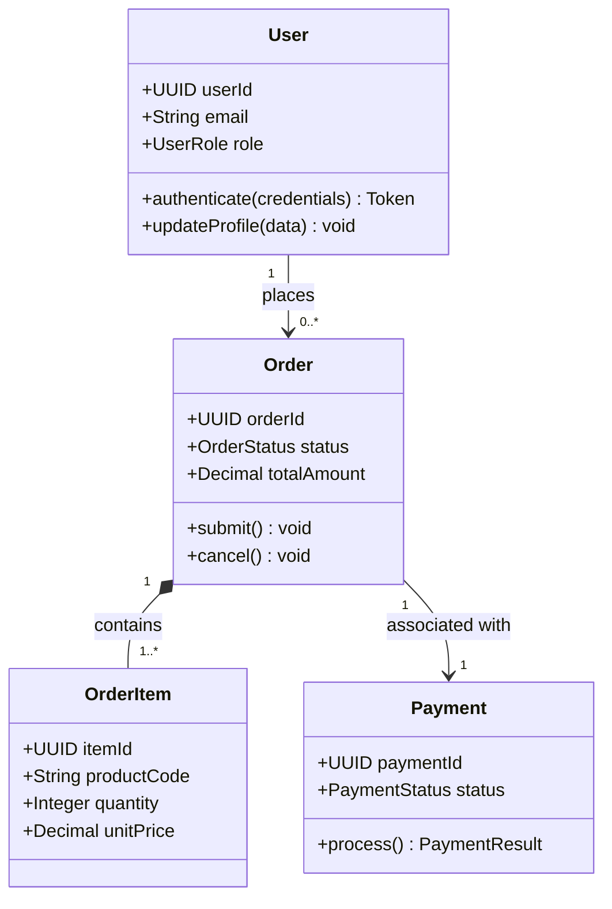
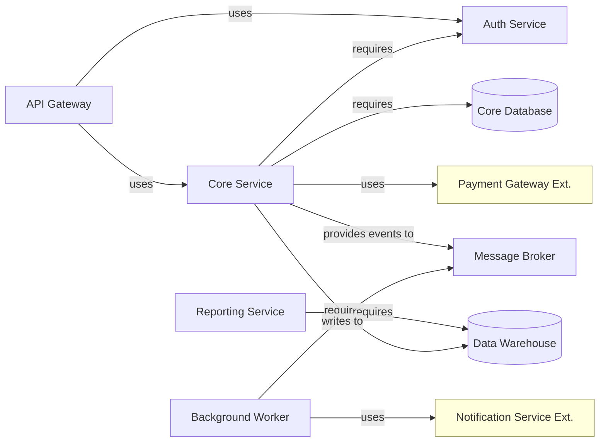
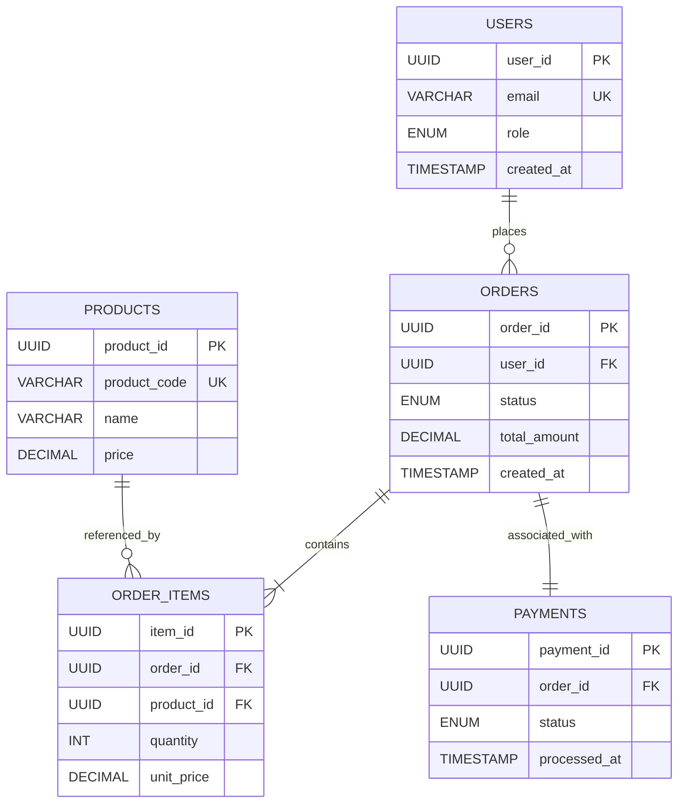
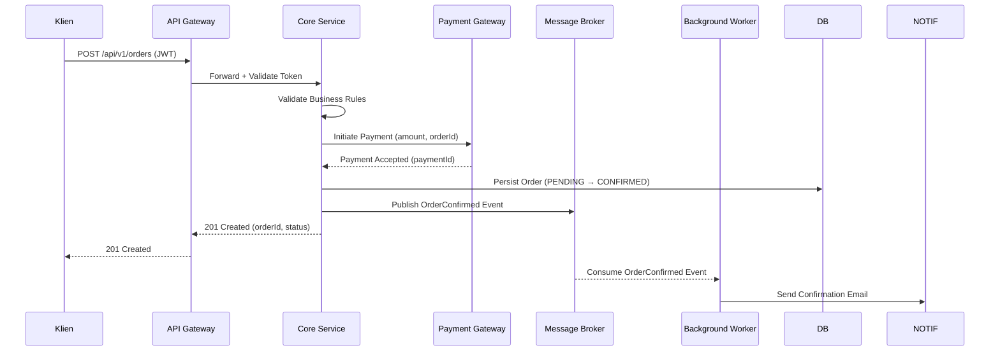
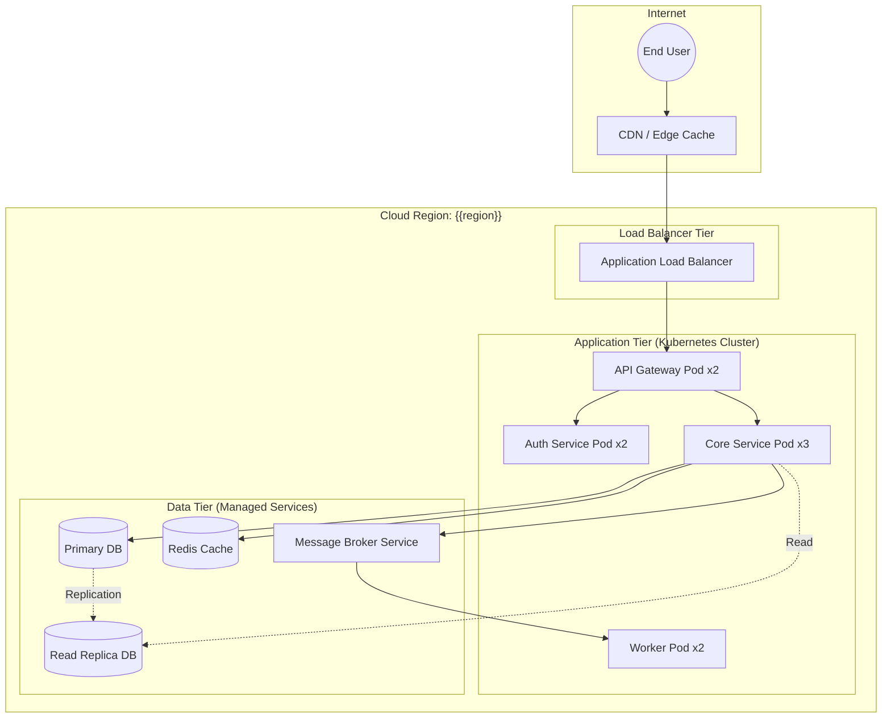
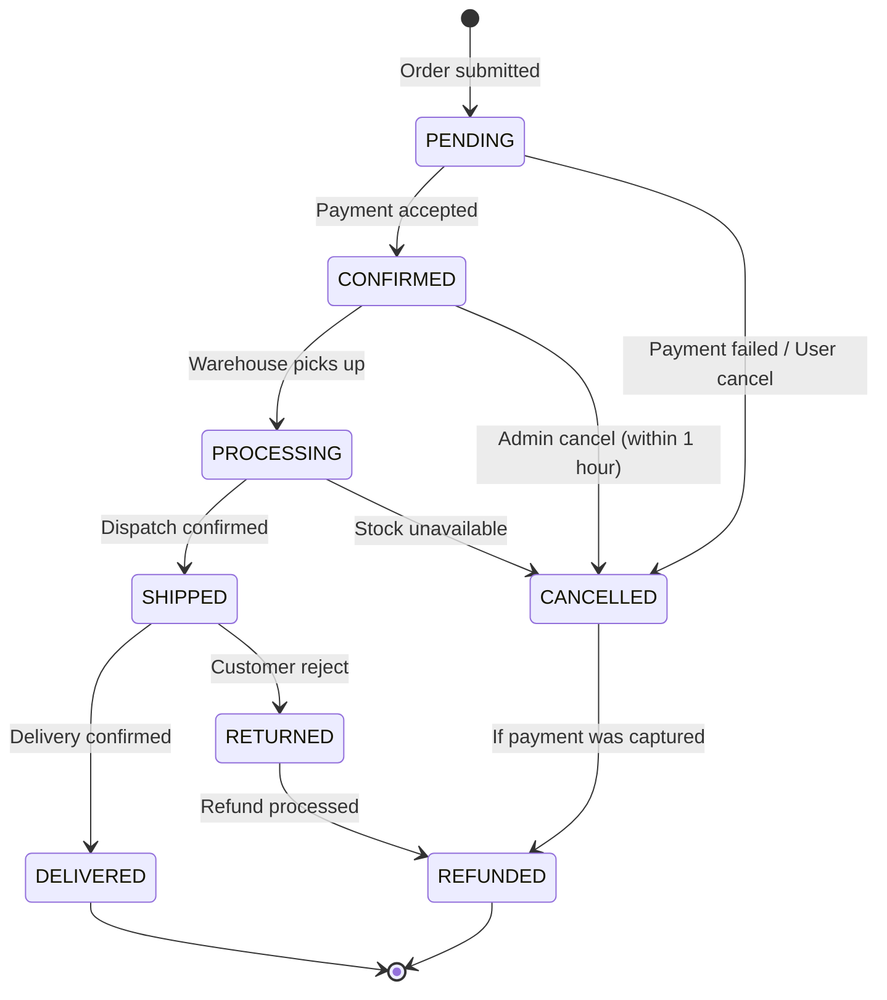

# BAB 3: DESIGN VIEWS

Bagian ini merupakan inti dokumen MSDD, di mana elemen arsitektural secara aktual digambarkan dan didokumentasikan berdasarkan viewpoint yang telah dipilih pada Bab 2. Setiap Design View harus cukup preskriptif untuk dapat diimplementasikan oleh developer, sekaligus cukup deskriptif bagi tim operasional yang memeliharanya.

---

## 3.0 Standar dan Aturan Penulisan Design View (Referensi Internal)

Bagian ini merupakan referensi teknis wajib bagi seluruh penulis dokumen MSDD untuk menjamin konsistensi format dan keterlacakan. **Bagian ini bersifat informatif untuk fase penyusunan dan wajib dihapus dari versi final dokumen setelah seluruh Design View selesai disusun.**

---

**Perintah (Instructions)**

Seluruh Design View pada sub-bab berikutnya wajib menggunakan template standar berikut. Pastikan setiap view memiliki ID yang unik, viewpoint yang terdaftar di Bab 2.2, representasi yang memadai (narasi dan/atau diagram), serta referensi silang ke MSRS dan/atau MADR yang relevan.

**Template Wajib Representasi Desain:**

```
- ID: DV-[NNN]-{judul-singkat}
  Contoh: DV-001-payment-gateway-interaction

- Title: [Nama singkat dan deskriptif dari tinjauan desain]

- Viewpoint: [Nama Viewpoint yang digunakan sesuai daftar di Bab 2.2]

- Representation:
  [Penjelasan naratif, pseudocode, atau diagram Mermaid yang memvisualisasikan desain]

- More Information:
  - REQ Reference: [REQ-ID dari MSRS yang diimplementasikan oleh desain ini]
  - ADR Reference: [Nama/path file MADR yang menjustifikasi keputusan desain ini]
```

**Aturan Identifikasi ID Design View:**

- Format: `DV-[NNN]-{judul}` di mana `NNN` adalah nomor urut tiga digit.
- ID bersifat unik dan tidak boleh diubah setelah ditetapkan untuk menjaga keterlacakan.
- Judul menggunakan format *kebab-case* (huruf kecil, kata dipisahkan tanda hubung).

**Catatan:** Setiap Design View harus mereferensikan minimal satu ID persyaratan dari MSRS (`More Information: REQ Reference`). Design View tanpa referensi MSRS dianggap tidak lengkap dan harus diklarifikasi sebelum dokumen difinalisasi.

### Contoh (Example)

---

**ID:** `DV-001-user-authentication-flow`

**Title:** Alur Otentikasi Pengguna

**Viewpoint:** Interaction

**Representation:**

Sistem mengimplementasikan alur otentikasi berbasis OAuth2 Authorization Code Flow dengan PKCE. Permintaan masuk dari klien diteruskan ke Auth Service yang memvalidasi kredensial terhadap Identity Provider (IdP). Setelah validasi berhasil, Access Token (JWT) dengan masa berlaku 15 menit dan Refresh Token dengan masa berlaku 7 hari diterbitkan dan dikembalikan ke klien.



**More Information:**
- REQ Reference: `REQ-FUNC-001` (Login & Autentikasi), `REQ-SEC-001` (Token Management)
- ADR Reference: `docs/decisions/ADR-001-use-oauth2-pkce.md`

---

## 3.1 Context View

Bagian ini mendeskripsikan sistem sebagai kotak hitam (black-box), menjelaskan batas sistem, aktor lingkungan, dan layanan eksternal yang berinteraksi dengan sistem.

---

**Perintah (Instructions)**

Gambarkan sistem sebagai satu entitas tunggal dan identifikasi seluruh aktor eksternal (pengguna manusia maupun sistem lain) yang berinteraksi dengannya. Tunjukkan arah aliran data dan jenis interaksi tanpa mengekspos detail internal sistem. Gunakan diagram C4 Context atau UML Use Case. Viewpoint ini menjawab pertanyaan: “Siapa yang berinteraksi dengan sistem ini dan bagaimana?”

**Catatan:** Diagram pada viewpoint ini harus konsisten dengan diagram batasan sistem (system boundary) pada MSRS sub-bab 1.2 dan diagram perspektif produk pada MSRS sub-bab 2.1. Setiap perbedaan harus didokumentasikan sebagai keputusan desain.

### Contoh (Example)

---

**ID:** `DV-[NNN]-system-context`

**Title:** Diagram Konteks Sistem

**Viewpoint:** Context

**Representation:**

Sistem `{{nama_sistem}}` berfungsi sebagai platform sentral yang melayani permintaan dari pengguna akhir melalui antarmuka web dan mobile. Sistem ini mengonsumsi layanan otentikasi dari Identity Provider eksternal, layanan pembayaran dari Payment Gateway, dan menyimpan data pada basis data relasional yang dikelola secara internal. Notifikasi dikirimkan kepada pengguna melalui layanan Email/SMS pihak ketiga.



**More Information:**
- REQ Reference: `REQ-FUNC-001`, `REQ-INT-SW-001`
- ADR Reference: `docs/decisions/ADR-002-external-idp-integration.md`

---

## 3.2 Composition View

Bagian ini mendeskripsikan bagaimana sistem dirakit dan dipecah menjadi subsistem, layanan, atau modul utama beserta tanggung jawab masing-masing komponen.

---

**Perintah (Instructions)**

Identifikasi dan deskripsikan komponen atau subsistem utama yang membentuk sistem. Jelaskan tanggung jawab utama setiap komponen dan bagaimana mereka saling berkolaborasi pada level tinggi. Dokumentasikan keputusan buy-vs-build untuk setiap komponen utama. Gunakan diagram UML Component atau Hierarchical Decomposition. Viewpoint ini menjawab pertanyaan: “Apa saja bagian-bagian utama sistem dan bagaimana mereka diorganisasikan?”

**Catatan:** Dekomposisi komponen pada viewpoint ini harus selaras dengan pembagian persyaratan (Apportioning of Requirements) pada MSRS sub-bab 2.6.

### Contoh (Example)

---

**ID:** `DV-[NNN]-system-composition`

**Title:** Dekomposisi Komponen Utama Sistem

**Viewpoint:** Composition

**Representation:**

Sistem `{{nama_sistem}}` terdiri dari empat komponen utama yang diorganisasikan dalam arsitektur layanan terpisah namun saling terhubung melalui API Gateway sebagai titik masuk tunggal (single entry point).



| Komponen | Tanggung Jawab Utama | Build/Buy | Teknologi |
| --- | --- | --- | --- |
| API Gateway | Routing, rate limiting, autentikasi token | Buy | `{{teknologi_gateway}}` |
| Auth Service | Manajemen identitas, penerbitan token OAuth2 | Build | `{{teknologi_auth}}` |
| Core Business Service | Logika bisnis utama, manajemen entitas | Build | `{{teknologi_backend}}` |
| Reporting Service | Agregasi data, pembuatan laporan | Build | `{{teknologi_reporting}}` |
| Background Worker | Pemrosesan asinkron, integrasi event | Build | `{{teknologi_worker}}` |

**More Information:**
- REQ Reference: `REQ-FUNC-001` s/d `REQ-FUNC-NNN`
- ADR Reference: `docs/decisions/ADR-003-microservices-decomposition.md`

---

## 3.3 Logical View

Bagian ini mendefinisikan struktur rancangan statis dari sistem, termasuk abstraksi utama (kelas, antarmuka), enkapsulasi, dan relasi antar elemen logis.

---

**Perintah (Instructions)**

Gambarkan abstraksi logis utama yang digunakan dalam sistem, termasuk kelas domain, antarmuka (interfaces), enumerasi, dan relasi penting (inheritance, association, dependency). Fokus pada elemen yang secara langsung merepresentasikan konsep bisnis atau domain sistem, bukan detail implementasi bahasa pemrograman tertentu. Gunakan diagram UML Class atau UML Object. Viewpoint ini menjawab pertanyaan: “Bagaimana konsep domain dimodelkan dalam kode?”

**Catatan:** Kelas dan antarmuka yang didefinisikan di sini harus dapat ditelusuri ke persyaratan fungsional (REQ-FUNC) di MSRS. Pastikan nama kelas konsisten dengan ubiquitous language yang telah disepakati oleh tim.

### Contoh (Example)

---

**ID:** `DV-[NNN]-domain-logical-model`

**Title:** Model Domain Logis

**Viewpoint:** Logical

**Representation:**



**More Information:**
- REQ Reference: `REQ-FUNC-010`, `REQ-FUNC-011`, `REQ-FUNC-012`
- ADR Reference: `docs/decisions/ADR-004-domain-model-design.md`

---

## 3.4 Dependency View

Bagian ini memetakan ketergantungan (dependencies) antar elemen desain untuk mendukung analisis dampak perubahan dan pemahaman ketergantungan build-time maupun runtime.

---

**Perintah (Instructions)**

Buat grafis yang menunjukkan arah ketergantungan antar modul, layanan, atau paket utama. Tandai secara eksplisit jenis ketergantungan: `uses`, `requires`, `provides`, atau `extends`. Identifikasi ketergantungan kritis yang dapat menjadi titik kegagalan tunggal (single point of failure). Gunakan diagram Dependency Graph atau UML Package. Viewpoint ini digunakan terutama untuk analisis dampak saat terjadi refactor atau pembaruan komponen.

**Catatan:** Ketergantungan pada pustaka atau layanan pihak ketiga harus secara eksplisit diidentifikasi, terutama yang berkaitan dengan keputusan lisensi atau SLA layanan eksternal sebagaimana didefinisikan pada MSRS sub-bab 2.5.

### Contoh (Example)

---

**ID:** `DV-[NNN]-service-dependency-map`

**Title:** Peta Ketergantungan Antar Layanan

**Viewpoint:** Dependency

**Representation:**



> **Keterangan:** Komponen dengan latar kuning adalah dependensi eksternal (pihak ketiga).
> 

**More Information:**
- REQ Reference: `REQ-INT-SW-001`, `REQ-INT-SW-002`
- ADR Reference: `docs/decisions/ADR-005-external-dependencies.md`

---

## 3.5 Information View

Bagian ini mendefinisikan semantik data persisten, hubungan antar entitas data, dan mekanisme pengelolaan serta akses data dalam sistem.

---

**Perintah (Instructions)**

Dokumentasikan model data utama yang digunakan sistem, termasuk entitas, atribut kunci, relasi, dan constraint integritas data. Gambarkan skema basis data pada level logis (bukan fisik), termasuk strategi indeksasi dan partisi jika relevan untuk performa. Gunakan diagram ERD atau Logical Data Model. Viewpoint ini menjawab pertanyaan: “Bagaimana data distrukturisasi, disimpan, dan dikelola?”

**Catatan:** Model data yang didefinisikan di sini harus konsisten dengan Kamus Data (Data Dictionary) pada Lampiran (Bab 5). Setiap entitas harus dapat ditelusuri ke persyaratan fungsional atau non-fungsional yang relevan di MSRS.

### Contoh (Example)

---

**ID:** `DV-[NNN]-core-data-model`

**Title:** Model Data Inti

**Viewpoint:** Information

**Representation:**



**More Information:**
- REQ Reference: `REQ-FUNC-010`, `REQ-FUNC-011`
- ADR Reference: `docs/decisions/ADR-006-database-schema-design.md`

---

## 3.6 Interface View

Bagian ini menetapkan kontrak kolaborasi yang terlihat secara publik antara komponen internal maupun dengan sistem eksternal.

---

**Perintah (Instructions)**

Spesifikasikan antarmuka (API) yang diekspos oleh setiap komponen atau layanan, termasuk nama endpoint, metode HTTP (untuk REST), parameter input, format respons (sukses dan error), dan skema otentikasi. Sertakan contoh payload JSON atau skema OpenAPI yang representatif. Gunakan format yang cukup detail untuk memungkinkan implementasi klien tanpa memerlukan klarifikasi tambahan. Viewpoint ini menjawab pertanyaan: “Bagaimana komponen atau sistem lain berinteraksi dengan layanan ini?”

**Catatan:** Spesifikasi antarmuka di sini merupakan kontrak teknis. Setiap perubahan pada kontrak antarmuka yang bersifat breaking harus didokumentasikan sebagai keputusan arsitektur baru di Bab 4 dan mengikuti prosedur Change Management yang didefinisikan pada MSRS sub-bab 3.5.10.

### Contoh (Example)

---

**ID:** `DV-[NNN]-core-service-api-contract`

**Title:** Kontrak API Core Service

**Viewpoint:** Interface

**Representation:**

**Endpoint: Pembuatan Order Baru**

| Atribut | Detail |
| --- | --- |
| Method | `POST` |
| Path | `/api/v1/orders` |
| Authentication | Bearer Token (JWT) |
| Content-Type | `application/json` |

**Request Body:**

```json
{
  "items": [
    {
      "product_id": "{{uuid}}",
      "quantity": 2
    }
  ]
}
```

**Response (201 Created):**

```json
{
  "status": "success",
  "data": {
    "order_id": "{{uuid}}",
    "status": "PENDING",
    "total_amount": 150000.00
  },
  "metadata": {
    "request_id": "{{uuid}}",
    "timestamp": "2024-05-20T10:00:00Z"
  }
}
```

**Response (422 Unprocessable Entity):**

```json
{
  "status": "error",
  "error": {
    "code": "VALIDATION_ERROR",
    "message": "Quantity must be greater than 0.",
    "field": "items[0].quantity"
  }
}
```

**More Information:**
- REQ Reference: `REQ-FUNC-011`, `REQ-INT-SW-001`
- ADR Reference: `docs/decisions/ADR-007-rest-api-versioning.md`

---

## 3.7 Interaction View

Bagian ini mendeskripsikan kolaborasi lintas entitas saat runtime, mencakup urutan pertukaran pesan, sinkronisasi waktu, perambatan error, dan transisi logika antar komponen.

---

**Perintah (Instructions)**

Gambarkan skenario interaksi kritis yang merepresentasikan alur bisnis utama (happy path) maupun skenario penanganan kegagalan (failure path). Tunjukkan urutan pemanggilan antar komponen, termasuk pesan sinkron dan asinkron, mekanisme retry, dan strategi error propagation. Gunakan diagram UML Sequence atau BPMN. Viewpoint ini menjawab pertanyaan: “Dalam urutan apa komponen-komponen berkolaborasi untuk menyelesaikan suatu tugas?”

**Catatan:** Skenario interaksi yang didokumentasikan harus mencakup setidaknya satu happy path dan satu failure path untuk setiap alur bisnis kritis. Skenario ini menjadi dasar bagi QA Engineer dalam menyusun test case integrasi.

### Contoh (Example)

---

**ID:** `DV-[NNN]-order-creation-sequence`

**Title:** Alur Pembuatan Order — Skenario Happy Path

**Viewpoint:** Interaction

**Representation:**



**More Information:**
- REQ Reference: `REQ-FUNC-011`, `REQ-FUNC-012`
- ADR Reference: `docs/decisions/ADR-008-async-notification-pattern.md`

---

## 3.8 Deployment View

Bagian ini mendefinisikan bagaimana komponen perangkat lunak dipetakan ke lingkungan eksekusi fisik atau komputasi cloud, termasuk topologi infrastruktur dan pipeline deployment.

---

**Perintah (Instructions)**

Gambarkan topologi deployment sistem di seluruh lingkungan relevan (Development, Staging, Production). Tunjukkan di mana setiap komponen dijalankan (container, VM, serverless function, managed service), bagaimana mereka terhubung secara jaringan, dan bagaimana pipeline CI/CD mengelola siklus delivery. Sertakan informasi mengenai skalabilitas (horizontal/vertical scaling) dan strategi rilis (blue-green, canary). Gunakan diagram UML Deployment atau IaC Topology.

**Catatan:** Desain deployment harus memperhitungkan persyaratan ketersediaan (availability) dan distribusi (distribution) yang didefinisikan pada MSRS sub-bab 3.3.4 dan 3.5.3. Setiap komponen yang memiliki SLA harus ditunjukkan strategi failover-nya secara eksplisit.

### Contoh (Example)

---

**ID:** `DV-[NNN]-production-deployment-topology`

**Title:** Topologi Deployment Lingkungan Production

**Viewpoint:** Deployment

**Representation:**



**More Information:**
- REQ Reference: `REQ-AVAIL-001`, `REQ-PERF-001`
- ADR Reference: `docs/decisions/ADR-009-kubernetes-deployment-strategy.md`

---

## 3.9 State Dynamics View

Bagian ini mendokumentasikan bagaimana komponen kritis merespons stimulus eksternal dan bertransisi di antara mode operasional yang berbeda.

---

**Perintah (Instructions)**

Identifikasi komponen atau entitas domain yang memiliki siklus hidup status (lifecycle) yang signifikan. Gambarkan seluruh status yang mungkin, kondisi transisi (guard conditions), dan aksi yang dipicu oleh setiap transisi. Pastikan seluruh status terminal (final states) dan status error terdokumentasi. Gunakan diagram UML State Machine. Viewpoint ini krusial untuk entitas domain yang statusnya memengaruhi alur bisnis kritikal.

**Catatan:** State machine yang didefinisikan di sini harus selaras dengan nilai enum yang terdefinisi pada Information View (Bab 3.5) dan kamus data di Lampiran (Bab 5).

### Contoh (Example)

---

**ID:** `DV-[NNN]-order-state-machine`

**Title:** State Machine Siklus Hidup Order

**Viewpoint:** State Dynamics

**Representation:**



**More Information:**
- REQ Reference: `REQ-FUNC-013`, `REQ-FUNC-014`
- ADR Reference: `docs/decisions/ADR-010-order-lifecycle-design.md`